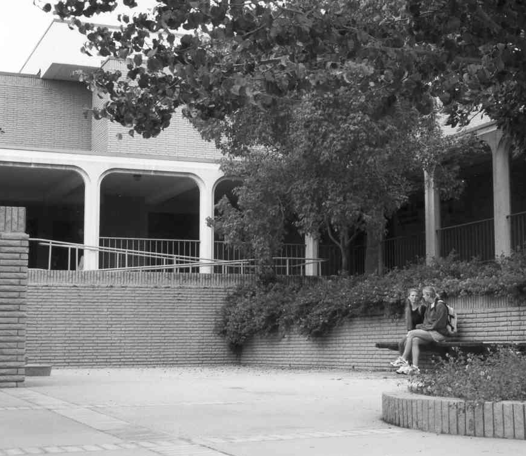
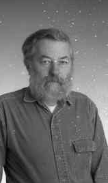
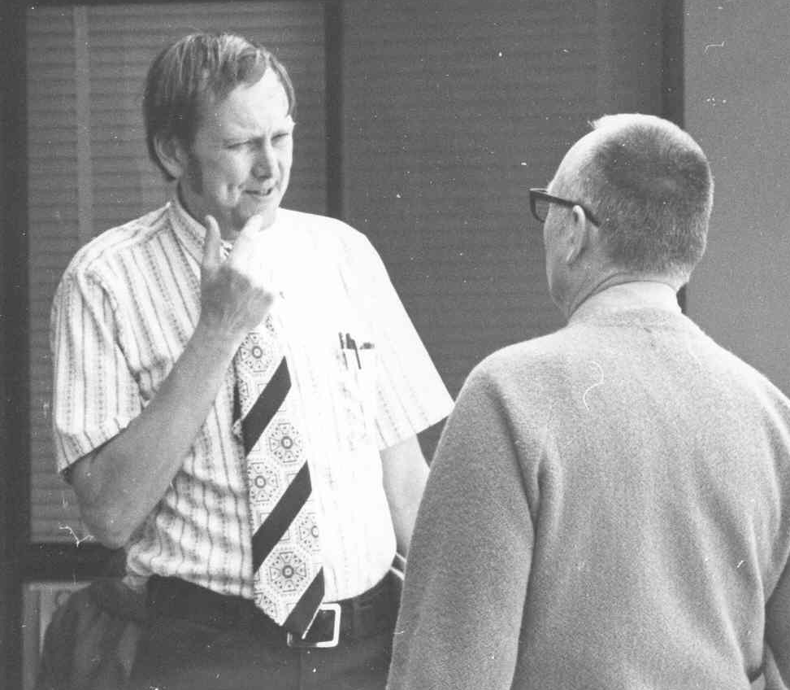
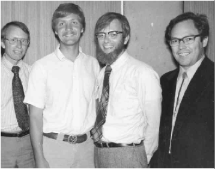
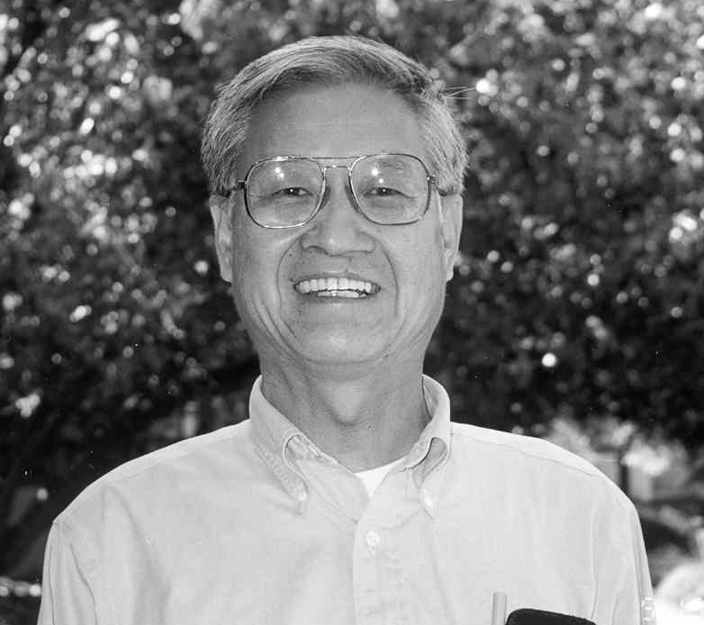

1969-1972 Curtis F. Gerald
==========================

General Computer Developments
-----------------------------

We lay out a brief framework of computer developments so the reader
understands the environment in which the creation of the computer
science department started. Keep in mind there is a delay between the
development of technology and its spread to academic and common usage.
What follows is a short summary of early, salient technological
breakthroughs in computer science. Dear reader, enjoy this stroll back
through computer history.

During the development and operation of ENIAC, John von Neumann, who had
a great interest in that machine, observed some limitations in its
design. Namely, the ENIAC could not hold programs or processed data in a
"memory" but had to rely on punch cards or tapes to keep track of
it. This slowed the machine’s potential drastically under certain uses.
Von Neumann then developed the idea of the "stored program" and his
model has become known as the Von Neumann Model, a simple CPU and memory
model upon which most modern computers are based. The first computer to
implement the stored program idea was the EDVAC (Electronic Discrete
Variable Arithmetic Computer).

In 1945, John von Neumann wrote "First Draft of a Report on the
EDVAC" in which he outlined the architecture of a stored-program
computer. Electronic storage of programming information and data
eliminated the need for the more clumsy methods of programming, wired
boards or punched paper tape. Hungarian-born von Neumann demonstrated
prodigious expertise in hydrodynamics, ballistics, meteorology, game
theory, statistics, and the use of mechanical devices for computation.
After World War II, he concentrated on the development of Princeton’s
Institute for Advanced Studies.[^3]

1.  In 1957, a new language, FORTRAN (short for FORmula TRANslator),
    enabled a computer to perform a repetitive task from a single set of
    instructions by using loops. The first commercial FORTRAN program
    ran at Westinghouse, producing a missing comma diagnostic. A
    successful attempt followed.

2.  On September 9, 1945, Grace Hopper recorded the first actual
    computer "bug" - a moth stuck between the relays and logged at
    15:45 hours on the Harvard Mark II. Hopper, a rear admiral in the
    U.S. Navy, enjoyed successful careers in academia, business, and the
    military while making history in the computer field. She helped
    program the Harvard Mark I and II and developed one of the first
    compilers. Her subsequent work on programming languages led to
    COBOL.

3.  In 1964, IBM announced the System 360, a family of six mutually
    compatible computers and 40 peripherals that could work together.
    The initial investment of $5 billion was quickly returned as orders
    for the system climbed to 1,000 per month within two years. PL/I and
    BAL allow one to write business, scientific, or system software for
    the System 360.

4.  In 1964, Thomas Kurtz and John Kemeny created BASIC, an
    easy-to-learn programming language, for their students at Dartmouth
    College.

5.  In 1965, Digital Equipment Corp. introduced the PDP-8, the first
    commercially successful minicomputer. The PDP-8 sold for $18,000,
    one-fifth the price of a small IBM 360 mainframe. The speed, small
    size, and reasonable cost enabled the PDP-8 to go into thousands of
    manufacturing plants, small businesses, and scientific laboratories.

6.  Hewlett-Packard entered the general purpose computer business with
    its HP-2115 for computation, offering a computational power formerly
    found only in much larger computers. It supported a wide variety of
    languages, among them BASIC, ALGOL, and FORTRAN.

7.  In 1968, Edsger Dijkstra’s ‘"GO TO Considered Harmful’’ letter,
    published in Communications of the ACM, fired the first salvo in the
    structured programming wars.

The history of the Cal Poly Computer Science Department, time wise,
spans much of the dynamic development of computing technology of the
last part of the 20th century. Fortran, IBM, System 360, BASIC, Digital
Equipment Corp., PDP-11 minicomputers, Hewlett-Packard, APPLE,
Microsoft, UNIX, C, event driven programming, C++, Java, Cisco, together
with the Internet all play a large part in this history.

In the next few chapters we show the evolution of the Cal Poly Computer
Science Department from its start in the mathematics department with
Ralph Weston, and Mansfield Clinnick, to its present location in the
College of Engineering with Computer Science, Computer Engineering and
Software Engineering degree programs. We hope you enjoy this journey
into the past and appreciate those who made it happen.

First Department Head, Curtis F. Gerald
---------------------------------------

We quote from a letter Curtis F. Gerald wrote in June 2002, to be
included in this history.

> Thirty-three years may seem a long, long time, but those early days of
> the department are still vivid in my memory. There have been many
> changes over the years.[^4]
>
> Our origin was in the Mathematics Department. Those faculty who taught
> computer science, statistics, and philosophy were split into a new
> department: Computer Science and Statistics. The reason for the
> conglomerate was to make the department of a size that justified the
> overhead of departmental status. It was Dean Clyde Fisher’s (now
> deceased) idea to do this and it was largely due to him that the
> growing stature of our discipline was recognized.
>
> Some thought it odd that philosophy and statistics were joined with
> us, but I sometimes said, “Philosophy teaches how we know what we
> think we know, Statistics teaches how we can be sure of what we know
> in the presence of uncertainty. Statistics obviously requires
> computers and at least the logic part of philosophy is fundamental to
> computers.”
>
> I was chosen to head the new “Computer Science and Statistics
> Department”, not because I was most knowledgeable, but, I guess,
> because I had held an administrative position in industry before
> coming to Cal Poly. This assignment was a most enjoyable one because
> everyone in the department was intelligent, eager and cooperative.
>
> At the same time that the department was formed, a new building was
> just completed that housed the data processing operations and had the
> IBM 360/40 with the key punches and printers on the first floor. So we
> moved into the offices that surrounded two outdoor patios.
>
> Both of these other disciplines later grew into their own department
> status, but by that time our own faculty had grown in numbers and the
> importance of computers and their utilization was more fully
> recognized.
>
> The major problem we faced in the beginning was finding qualified
> faculty and adequate resources. We were fortunate that some excellent
> people were found and we made do with what now seems primitive
> computing power. I remember that the first “mainframe” had 128K bytes
> of memory and it replaced an even more primitive “minicomputer”. When
> we tried to run a single graphics terminal from the “mainframe”, we
> had to dedicate the complete computer to that service!
>
> At the start, we thought that computer courses should emphasize
> applications. We had little in the way of computer science theory in
> the early days. Of course, that aspect of computer science had barely
> begun its development. There was little emphasis on hardware as
> Electronic Engineering had the monopoly there.
>
> It is gratifying to me to see how things have progressed in these 33
> years. I am proud to have had a part in starting what has become one
> of the more respected department of computer science in the nation!

[

Editor’s Note: I talked with Curtis F. Gerald on the telephone on June
10, 2002. He informed me that he is 87 years old as of last week and is
revising the seventh edition of one of his books, “Applied Numerical
Analysis”, Addison Wesley, written by Curtis F. Gerald and Patrick
Wheatley. Not many books go to the seventh edition and not many people
are still writing at 87. Surprising? Not to us – we know Curtis.]

Curtis F. Gerald and Daniel Stubbs, both provided leadership as
Department Heads.

View From the Dean
------------------

To formulate an idea of the thinking within the School of Applied
Sciences of the genesis of the Cal Poly Computer Science Department we
summarize an article in the faculty newsletter, “Cal Poly Today,” of
October 5, 1969, written by Dean Clyde Fisher.

> Dr. Curtis F. Gerald who heads up the new Computer Science Department
> has been a member of the Cal Poly Mathematics Department faculty since
> 1964.[^5] Gerald earned a B.S. degree at Iowa State University in
> 1936; M.S. degree at the University of Cincinnati in 1938 and his
> doctorate from MIT in 1941. He has engaged in research for the
> Universal Oil Products Co., and the El Paso Natural gas company and
> has taught at the University of Washington.
>
> Cal Poly’s new B.S. degree in Computer Science trains students to do
> programming in the business and scientific areas and to solve problems
> in computer related areas. Cal Poly’s Computer Science graduates will
> have a strong foundation in mathematics. Of the 198 quarter units of
> work required for graduation, 26 are in mathematics with the remaining
> in computer science, electronic engineering, operations research,
> statistics, accounting and economics. Students will become familiar
> with languages such as FORTRAN, COBOL, PL/I, BASIC, Assembler and JCL
> for OS 360, the operating system for the IBM 360/40.
>
> The Computer Science Department faculty and classrooms are housed in
> the new $1.6 million Computer Science Building centrally located on
> the campus. The main entry to the building is from a landscaped
> courtyard adjacent to Engineering West. Stairways lead from the
> courtyard to the entry. The structure contains two inner courtyards.
> Offices for faculty members are arranged around courtyards – each
> office with an outside entrance. The facility contains 12 general
> lecture rooms, 6 laboratories for the Computer Center which recently
> was equipped with the College’s main computer, an IBM 360/40.

Two students in the west patio outside the Computer Science Building.

> The Computer Science and Statistics Department will start operations
> in the Fall of 1969 and is an integral part of the School of Applied
> Sciences with Clyde Fisher as Dean.

[

Editor’s Note: Apart from the name, today’s Computer Science Curriculum
bears little resemblance to its counterpoint of 1969. The growth in this
discipline has been extraordinary. Today’s computer science student
takes about 2 times as many computer science units as in 1969. Courses
such as graphics and artificial intelligence were then in their infancy.
Students studied compilers, linkers, assemblers, and operating systems
with applications such as simulation, numerical analysis, operations
research, and mathematics. Courses such as data structures, software
engineering, networks, distributed computing, knowledge-based systems,
micro computers, object oriented programming, and event driven
programming had barely been dreamed of in 1969.]

Curtis F. Gerald and Programmer, Marc Lewis, at work on the IBM 360-40
in 1971.

View from the Computer Center Director
--------------------------------------

In September 1969, the Department of Computer Science and Statistics was
formed.[^6] Our new building was completed and I joined the Cal Poly
faculty that year with an administrative assignment to direct the new
computer center. The initial equipment delivered was an IBM 360/40 with
128K of memory and 14.5 meg of disk space. It was a card-oriented system
with a single user, single partition operating system called Primary
Control Program or PCP. This was later upgraded to multiprogramming with
a fixed number of tasks or MFT.

If you weren’t in this business in the 1970s, you may think about the
capacity of your Macintosh or Pentium and wonder how we could get
anything done, let alone support a 9,000 student campus. My answer lies
in the comparison between a Model A Ford and a new car today. The
difference in comfort, convenience, speed, safety and reliability are
overwhelming, but the basic point A to point B transportation is about
the same.

The significant differences since 1969 are in the user interface.
Students then prepared jobs on decks of punched cards submitted in
batches, and they soon overwhelmed the processing capacity. We were
queuing from a finite population, and turnaround time leveled off at
around 25-30 hours.

Queues of jobs waiting to be processed by the IBM 360-40 at the Computer
Center in 1970.

The “ready room” or “card punch room” was a popular place 24 hours a
day. Besides queuing up for the use of the few card punches, a lot of
careful planning and proofreading time was warranted before committing
your deck to a 30 hour tour of the machine room; perhaps only to find a
misplaced comma. The social and technical atmosphere gave birth to many
long term professional collaborations and even a few start-up companies.

The management and public relations strategies were interesting case
studies. One of our most effective strategies for minimizing decibels of
complaint was keeping the queue visible. We queued trays of our cards on
tables with clearly visible job submission times so users could see how
far back their jobs were. Priority algorithms were a constant challenge.
We also realized that maintaining custody of the decks was a necessary
filter to slow down resubmissions.

Still we managed, and kept our mission in clear focus. When we shoved
that 30 hour backlog aside, and turned the only serious machine on
campus over to Professor John Hsu’s operating system class at midnight
on Saturday nights you knew we were determined to support computer
science. A comforting thought as long as you didn’t have to clamber out
of bed and actually be there.

Ray Boche, Computer Center Director in 1969.

Csc/Statistics/Philosophy Department
------------------------------------

The Philosophy part of the department split off in 1970 and James T.
Culbertson and Arthur Bethel went to the new Department. The Philosophy
group were less involved with logic, as it relates to computers, and
much more into liberal arts type of philosophy, so it was a good
decision.

Charter faculty in the Computer Science and Statistics Department
consisted of the following 13 faculty members. As you can see, 7 were
primarily involved with computer science, 4 in statistics and 2 in
philosophy. As Curtis mentioned in his letter, his first objective was
to hire people in computer science with experience and if possible with
a Ph.D. degree.

-   William O. Buschman (1956), Csc, Ed.D., Oregon State University.

-   James T. Culbertson (1953), Philosophy, Ph.D., Yale.

-   Robert H. Dourson (1967), Csc, M.S. Cal Tech.

-   Kenneth F. Fuller (1960), Statistics, Ph.D., Columbia University.

-   Curtis F. Gerald ( 1964), Csc, Ph.D., M.I.T.

-   Reino Hannula (1962), Csc, M.S., UCLA.

-   Elmo A. Keller ( 1963), Csc, Ph.D., Iowa State University.

-   Y. Leon Maksoudian, (1963), Statistics, Ph.D., Minnesota.

-   John Groves, (1968), Statistics, Ph.D., Kansas State University.

-   Daniel F. Stubbs, (1963), Csc, Ph.D., Rensselaer Polytechnic.

-   Sing-Chow Wu, (1969), Statistics, Ph.D., Colorado State University.

-   Arthur Bethel, (1968), Philosophy, M.A., UCSB.

-   Neil W. Webre, (1969), Csc, A.M. Harvard University.

The recruiting committee, consisting of Curtis F. Gerald, Elmo A.
Keller, and Gary F. Fuller worked hard to hire qualified people with
experience in computer science. We felt that the Statistics side of the
department had both experience and proper academic qualifications.
Computer science was a new discipline and no one quite knew whether it
was a part of mathematics or electrical engineering or a discipline by
itself.

In 1970, we hired the following four faculty members:

-   Emile E. Attala, (1970), Csc, Ph.D., UCSB.

-   Bernard Evans, (1970), Csc, Ph.D., Purdue University.

-   John Y. S. Hsu, (1970), Csc, Ph.D., U.C. Berkeley.

-   John M. Rogers, (1970), Statistics, Ph.D., V.P.I.

Emile, Bernie, and John Hsu all had industrial experience as well as
academic qualifications. As I look back, 32 years later, I can see that
the 1969-1970 new faculty members had a tremendous impact on the future
direction of the Csc department. Each in his own way, gave needed focus
to the evolving department.

Neil Webre pushed hard right from the beginning for abstract data types,
expanding the curriculum for new courses in data structures and
initially used parts of Donald Knuth’s books for the course. He also was
instrumental in using and teaching languages such as Pascal, Modula-2,
Ada and C/C++. He and Daniel F. Stubbs wrote a series of books on Data
Structures with Abstract Data Types with Pascal, ..., ADA where each
language represented a different book. Both Daniel and Neil provided
excellent leadership as Csc Department Chairmen. Neil, ahead of his
time, insisted that software be designed, and was instrumental in
organizing Cal Poly Csc Department’s first software engineering course
in 1981.

Bernard Evans taught numerical analysis courses for a few years and
always pushed for a laboratory where he and students could put together
computer hardware and write the controlling software. When Bernie heard
the following news, he could wait no longer.

> “Intel and Zilog introduced new microprocessors five times faster than
> its predecessor, the 8008. The Intel 8080 could address four times as
> many bytes for a total of 64 kilobytes. The Z-80 could run any program
> written for the 8080 and included twice as many built-in machine
> instructions.”

He had the department purchase Intel 8080 microcomputers and set up a
lab for the computers. To my knowledge this was the first laboratory
course in the Csc Department. Bernie set up micro computers and an
electric train and had sensors built into the tracks so the computers
could sense and control the action of the train. These courses, then
numbered, Csc 309 and Csc 409, involved Cal Poly Computer Science
Department early into microcomputers. Ralph Nicovich was hired as the
first laboratory technician and Jay Bayne named the lab, “Computer
Systems laboratory.” (CSL) Neal Pollack, Alan Bell, Jerry Derby, Gerhard
Vanderloop, Gilbert Keas, and Haley Landis were some who worked in the
CSL as well as the current director, Don Erickson, and his associates,
Byron J. Smith, Tom Cubanski, and a whole host of student assistants
over the years.

Emile Attala brought an innovative idea to the Cal Poly Computer Science
Department. We had always relied on the State of California for all of
our funding and if we ended up short we just complained. Emile took the
cause to industries and they supported him in this goal. Over the years,
many companies have generously donated equipment and money to the Csc
department such as Hewlett Packard, Tandem, Xerox, Apple, Chevron, Sun,
TRW, Cisco, Ziatech, Microsoft, Fluke, AT&T, Intel, Netcom, 3Com,
Digital Research, Borland, and many others. Emile, an excellent
ambassador to the computer industry for Cal Poly, received many dollars
in grants. When Emile became Department Chair, one of his objectives was
to raise money by contacting industry. Highly successful in this work,
he became a consultant to President Warren J. Baker to do the same for
the whole University.

John Hsu desired to teach students all the system software. He did not
let us forget important areas such as compilers, linkers, and operating
systems as well as computer architecture. Instrumental in designing many
of the courses in systems software as well as networks, John has written
books in all areas of system software and hardware, from networks to
architecture.

Three professors hired in 1973 set a definite direction for the
department. It is hard to imagine now, that developments at Bell
Laboratories, DOD with ARPANET, and Xerox would have a such a tremendous
impact on computer science and society. Jay Bayne, Joe Grimes, and James
Beug pushed hard for UNIX and networks. Many of the courses we now teach
relative to these two areas were developed initially by Jay Bayne, Jim
Beug or Joe Grimes. Jim held the record in the Csc Department for
providing leadership as Chair for the longest tenure, while Joe probably
holds the record for principal investigator receiving the most grants.

-   Jay S. Bayne, (1973), Csc, Ph.D., UCSB

-   James Beug, (1973), Csc, Ph.D., Ohio State University.

-   Joseph Grimes, (1973), Csc, Ph.D., Iowa State University.

In 1969, AT&T Bell Laboratories programmers Kenneth Thompson and Dennis
Ritchie developed the UNIX operating system on a DEC minicomputer. UNIX
combined many of the timesharing and file management features offered by
Multics, from which it took its name. Multics, a project of the
mid-1960s, represented the first effort at creating a multi-user,
multi-tasking operating system. The UNIX operating system quickly
secured a wide following, particularly among academics, engineers and
scientists.

This development was followed in 1970 with the start of the INTERNET.
Computer-to-computer communication expanded when the Department of
Defense established four nodes on the ARPANET: the University of
California Santa Barbara and UCLA, SRI International, and the University
of Utah. Viewed as a comprehensive resource-sharing network, ARPANET’s
designers set out with several goals: direct use of distributed hardware
services; direct retrieval from remote, one-of-a-kind databases; and the
sharing of software subroutines and packages not available on the users’
primary computer due to incompatibility of hardware or languages. In
1973, Robert Metcalfe devised the Ethernet method of network connection
at the Xerox Palo Alto Research Center.

Jay Bayne came from UCSB, one of the university nodes in the original
ARPANET. He designed the first campus wide networking plan for Cal Poly
as well as starting a network course early in the Csc curriculum.

In 1974, Cal Poly bought several Lundy vector scopes for doing computer
graphics, along with a DEC PDP-11/35 system running RSTS. Unfortunately,
this was not a very good software environment for students doing
graphics programming. When Jim Beug read the 1974 article in the
Communications of the ACM by Ritchie and Thompson describing the Unix
time sharing system, he obtained an educational version from Bell Labs
for the PDP-11 graphics system. John Bass, a Csc major who was later to
work on a number of Unix systems, installed the system for the computer
center. Thus the department was one of the very early users of Unix.
This provided students with exposure to a very elegant interactive
programming environment, as well as to the C programming language, at a
time when most schools were doing Fortran on card based batch systems.

Unix and C have been an integral part of the program from that time.
Over the years we have had variations of Unix such as Solaris, SunOS,
AIX, HPUX, BSD, System V Unix, and various flavors of Linux.
Jay Bayne, Jim Beug, John Hsu, Elmo A.
Keller, John Connely and others have used Unix or a derivative such as
Xinu, MINIX, or Linux to teach operating system classes since that time.

Charles Welty, James Bohle and Corine Bickley, all with M.S. degrees in
Csc were hired in 1971-72. They taught for 2 years and then went back to
school to earn Ph.D.'s.  James C. Daly was hired in 1972. Later, in
1984, when Csc and Statistics each became separate departments, James
became the first Chairman of the Statistics Department. Sham S. Luthra
was hired in 1972 to teach operations research courses in the Csc
curriculum.

At this point in time, applications on mainframe computers dominated our
curriculum with Fortran, PL/I and 360 assembly (BAL) being the main
languages used. Computer science was viewed as “solving problems using a
computer.” The big emphasis was solving “real world” problems, using
modeling, mathematics, statistics or probability. Programming was the
vehicle one learned to be able to use the computer.

Bernie Evans and Curtis Gerald in 1971.

Three Csc faculty members in earlier years: Daniel Stubbs, Craig
Hollingworth (student), Jim Beug, and Elmo A. Keller.

Jay Bayne in Computer Science patio.

John Hsu came to Cal Poly in 1970, was a key faculty member in systems
programming, and retired in 2002.
