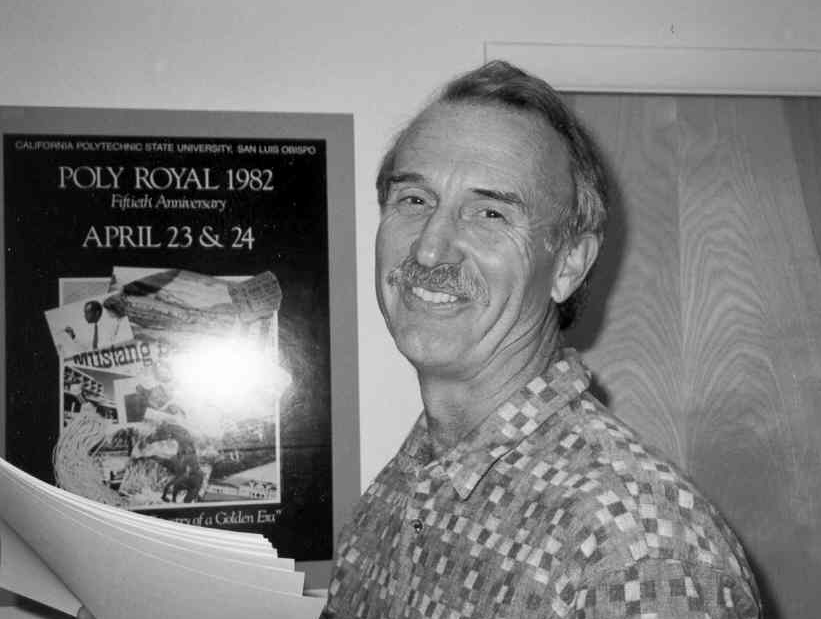
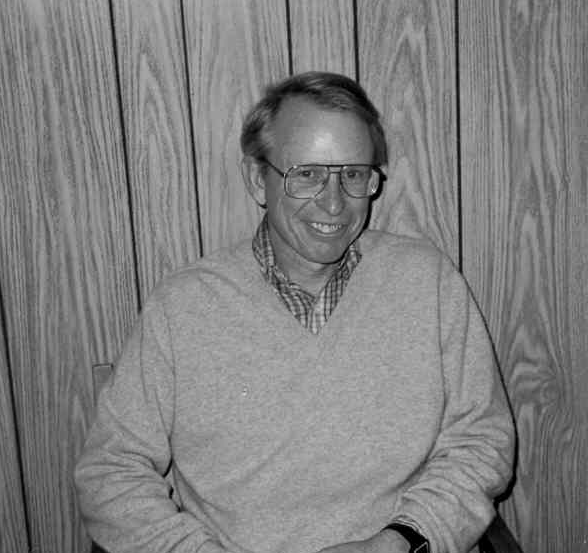

1972-1977 Department Head Daniel Stubbs
=======================================

Introduction
------------

Curtis F. Gerald served as Department Head until 1972. Leon Maksoudian
became acting Head until the Department recommended Daniel Stubbs as the
new Head and this action was approved by Dean Clyde Fisher, and the
appointment made by President Robert E Kennedy in the Fall of 1972.

Daniel Stubbs with the Computer Science office staff, left to right:
Clary Lobato, Janice Zoradi, Meri Kay Gurnee, Daniel Stubbs, and Lynda
Alamo.

Computer Developments
---------------------

Some interesting things happening in the computer science evolution
during Professor Stubbs’ tenure as Department Head are listed below:[^9]

1.  The January 1975 edition of Popular Electronics featured the Altair
    8800 computer kit, based on Intel’s 8080 microprocessor, on its
    cover. Within weeks of the computer’s debut, customers inundated the
    manufacturing company, MITS, with orders. Bill Gates and Paul Allen
    licensed BASIC as the software language for the Altair. Ed Roberts
    invented the 8800 – which sold for $297 or $395 with a case – and
    coined the name “personal computer”. The machine came with 256 bytes
    of memory (expandable to 64K) and an open 100-line bus structure
    that evolved into the S-100 standard.

2.  In 1976, Steve Wozniak designed the Apple I, a single-board
    computer. With specifications in hand and an order for 100 machines
    at $500 each from the Byte Shop, he and Steve Jobs got their start
    in business. About 200 of the machines sold before the company
    announced the Apple II.

3.  The Cray I made its name as the first commercially successful vector
    processor in 1976. The fastest machine of its day, its speed came
    partly from its shape, a C, which reduced the length of wires and
    thus the time signals needed to travel across them.

4.  In 1976, Gary Kildall developed CP/M, (Control
    Program/Microprocessor) a simple operating system for computers.
    Widely adopted, CP/M made it possible for one version of a program
    to run on a variety of computers built around eight-bit
    microprocessors compatible with 8080 and Z80. He also wrote a high
    level language, PL/M, for microcomputers.

5.  In 1977, the Apple II became an instant success when released with
    it’s printed circuit motherboard, power supply, keyboard, case
    assembly, manual, game paddles, A/C power cord, and cassette tape
    with the computer game \`"Breakout\`" (6502 based CPU). Within two
    years, Harvard MBA candidate, Daniel Bricklin, and programmer,
    Robert Frankston, developed VisiCalc, the program that made a
    business machine of the personal computer, for the Apple II.
    VisiCalc (for Visible Calculator) automated the recalculation of
    spreadsheets. A huge success, more than 100,000 copies sold in one
    year.

6.  In the first month after its release in 1977, Tandy Radio Shack’s
    first desktop computer – the TRS-80 – sold 10,000 units, well more
    than the company’s estimate. Priced at $599.95, the machine included
    a Z80 based microprocessor, a video display, 4 kilobytes of memory,
    BASIC, cassette storage, and easy-to-understand manuals.

Csc M.S. Program
----------------

In 1973, the Cal Poly Csc M.S. program began. The graduate committee
composed of Bernard Evans, John Hsu, Curtis Gerald, and Elmo A. Keller
designed a flexible program allowing students to concentrate in
different areas of study. Admission to the program required a B.S.
degree from an accredited institution with at least a B average. Keep in
mind that in 1973, there were not many Csc graduates, and this program
allowed for students to be re-trained in the computer field.

Fundamental to this program for students without a computer science
background, a 15 unit sequence was developed called “Foundations of
Computer Science.” The intensive course provided background in computer
science for non-majors and was required for entry into the M.S. program
for non-Csc majors. The course content consisted of computer
architecture, assembly, Pascal/C programming, data structures,
algorithms, compilers, and introduction to operating systems. This
sequence was taken in the summer before entry into the program.

A practicum in computer science, for 5 units, required students to
“document and solve a practical problem in Csc selected from a business,
industrial or scientific organization under the guidance of
representatives from the cooperating organization and a member of the
Csc faculty.”

There were four tracks of courses and students selected 2 areas of
speciality:

-   Modeling and Simulation,

-   Numerical analysis,

-   Computer systems and software,

-   Information Processing.

The remaining units were selected from 400-500 level courses, a required
seminar, and either thesis or an exam. Remember, this was in 1973 and
computer science has evolved a long way over the past quarter of a
century. Nevertheless in 1973, students in the M.S. program had to solve
a “real computer related problem” outside the domain of the university.

Daniel Stearns, graduate of Cal Poly University and UC Berkeley, now a
Csc Faculty member.

Computer Systems Laboratory
---------------------------

In 1974, the Csc Department acquired a PDP-11 and loaded the Unix
Operating System, thanks to Jay Bayne and Jim Beug. The machine was
housed in a room provided by the Cal Poly Computer Center. This started
a long association with Cal Poly Csc Department and Unix – over 25
years. Shortly thereafter, we started a course on C and Unix that has
been going strong ever since. Our main computing unit at this time
remained IBM 360/40, but the Unix “PDP-11” provided the faculty with C
programming, printing, and intra-departmental mail. Some in the Computer
Science Department have had over a quarter of a century of using Unix
mail. The department also had a Data General minicomputer, but it served
only as a vehicle for an assembly course taught by Jay Bayne.

The first laboratory, as I recall, was in room 14-240, the one with the
windows in the front, now occupied by the Engineering and Computer
Science Accreditation and Assessment Center. This first laboratory in
the Computer Science and Statistics Department consisted of programmable
calculators that were used in some statistics courses. Technology
changed rapidly and when microcomputers became available, this became
Bernie Evans’ room. Located in this laboratory were an elaborate
“electric train and tracks”, a work bench, some 8080 Intel INTELEC
microcomputers and the Data General minicomputer.

Bernie Evans organized the first micro computer courses using the 8080
machines and his big project was to write software to control the train.
He built sensors in the tracks and with his students wrote in 8080
assembly and PL/M the software to control the operation.

Later in 1977, Emile Attala hired Ralph R. Nicovich to be the first
technician and later director of the Computer Systems Laboratory with
Neal Pollock, Alan Bell, and Haley Landis who transferred from the Csc
Department office to the laboratory as a software technician.

Computer Science Curriculum
---------------------------

Cal Poly University is one of five major universities in the United
States that has been recognized by a national research organization for
its exemplary computer science curriculum.[^10]

The selection was made as a part of a federally-funded research project
sponsored by the National Science Foundation and conducted by the Human
Resources Research Organization. (HumRRO)

Dr. William Langworthy, Dean of the School of Science and Mathematics,
said, “The results of the HumRRO survey reflect what is known on campus,
but it is nice to have corroboration from an outside source.” The five
universities were Rutgers University, University of Texas, Purdue
University, Mankato State University, and California Polytechnic State
University at SLO.

The research project entailed surveying 7,000 agencies, educational
institutions and individuals. From this sample of 106 institutions, five
were chosen because of excellence in one of the following areas:

-   Spectrum of Applications,

-   Computer Literacy Program,

-   Computer Science Curriculum,

-   Outreach to the community.

Daniel Stubbs as Computer Science and Statistics Department Head.

Neil Webre, Curtis Gerald, Jay Bayne, and John Hsu in the early days of
the Computer Science Department.

Left to right: Sham Luthra, (1972) operations research and core
sequence; Joseph Grimes (1973) director of CSL and CPE programs,
networks and computer architecture.

Roy Holstien, started at Cal Poly in 1973 and retired in 1987. Roy
taught in the areas of numerical analysis as well as continuous and
discrete simulation.
