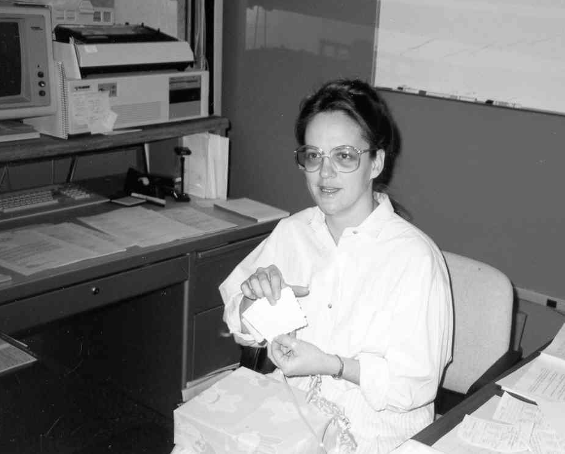
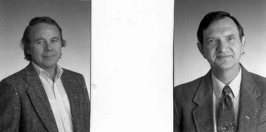
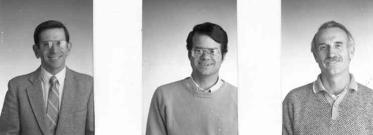
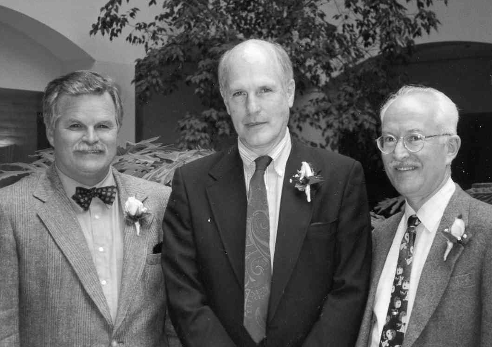

1983-1986 Department Chair-Neil Webre
=====================================

Introduction
------------

As Neil Webre took over as Chair of the Computer Science and Statistics
Department in 1983, approximately 500 students were majoring in Csc with
450 of these at the undergraduate level. Students considering Cal Poly
apply for a specific major and thus the Csc Department obtained the
following information about the future classes. The average SAT score of
those admitted was 1200 and the average high school GPA was 3.71 with
over 90% of those admitted reporting for registration.

The department was allocated 36.1 full time positions of which 25 were
in computer science.

Neil Webre , Computer Science and Statistics Department Chair.

Computer Developments 
----------------------

During Neil Webre’s time as Chair, what was going on in the computer
evolution?[^14]

1.  1983: Microsoft announced Word, originally called Multi Tool Word,
    and Windows. The latter doesn’t ship until 1985, although the
    company said it would be on track for an April 1984 release. In a
    marketing blitz, Microsoft distributed 450,000 disks demonstrating
    its Word program in the November issue of PC World magazine.

2.  1983: Compaq Computer Corp. introduced the first PC clone that used
    the same software as the IBM PC. With the success of the clone,
    Compaq recorded first-year sales of $111 million, the most ever by
    an American business in a single year.

3.  1985: The modern Internet gained support when the National Science
    foundation formed the NSFNET, linking five supercomputer centers at
    Princeton University, Pittsburgh, University of California at San
    Diego, University of Illinois at Urbana-Champaign, and Cornell
    University. Soon several regional networks developed; eventually,
    the government reassigned pieces of the ARPANET to the NSFNET.

4.  1985: Compaq beat IBM to the market when it announced the Deskpro
    386, the first computer on the market to use Intel’s new 80386 chip,
    a 32-bit microprocessor with 275,000 transistors on each chip. At 4
    million operations per second and 4 kilobytes of memory, the 80386
    gave PCs as much speed and power as older mainframes and
    minicomputers. The 386 chip brought with it the introduction of a
    32-bit architecture, a significant improvement over the 16-bit
    architecture of previous microprocessors. It had two operating
    modes, one that mirrored the segmented memory of older x86 chips,
    allowing full backward compatibility, and one that took full
    advantage of its more advanced technology. The new chip made
    graphical operating environments for IBM PC and PC-compatible
    computers practical.

5.  1986: Daniel Hillis of Thinking Machines Corporation moved
    artificial intelligence a step forward when he developed the
    controversial concept of massive parallelism in the Connection
    Machine. The machine used 16,000 processors and could complete
    several billion operations per second. Each processor had its own
    small memory linked with others through a flexible network that
    users could alter by reprogramming rather than rewiring.

6.  In the early 1980’s, the Xerox Alto started the graphical user
    interface revolution which would sweep through the computer industry
    over the following decade. The desk-sized Alto, and its
    commercialized descendant the Xerox Star, were the first GUI-based
    computers. Researchers at Xerox PARC (Palo Alto Research Center)
    developed the basic ideas of a graphical user interface along with
    all the associated innovations - the mouse, the desktop metaphor,
    icons, windows, menus etc. Although the ideas in the Xerox Star were
    revolutionary, it failed commercially, due mainly to the price tag
    of $50,000.

7.  When Steve Jobs took a tour of Xerox PARC in 1979, he saw the Alto
    and realized it was the future of computing. He quickly began to
    work towards bringing the technology to market. Many of the ideas in
    the Alto showed up two years later in the Apple Lisa, and finally
    made it to market in the Apple Macintosh. Several Xerox researchers
    left to join Apple.

Csc Curriculum in 1984
----------------------

Neil Webre worked hard to include design and “software engineering” into
the curriculum. To gain a flavor of the early department, this section
outlines the main part of the Csc curriculum in 1984.[^15]

-   Csc 118: Introductory Programming - Pascal.

-   Csc221-222/309-409: Intro. to Arch. & Assembly programming.

-   Csc 245: Discrete Mathematics.

-   Csc 345: Data Structures.

-   Csc 340: 440: Software Engineering and software tools.

-   Csc 304: Computer Architecture.

-   Csc 453, 454: Operating Systems & Real Time Kernels.

-   Csc 404: Networks.

-   Csc 351, 450, 451: Assemblers, Compilers, and Linkers.

-   Csc 346,446: Database Systems.

-   Csc 461,462,463: Senior Project.

Computer Science Curriculum Flowchart in 1984.

Science and Mathematics to Engineering
--------------------------------------

From 1983 to 1985 Bill Horton served the College of Engineering as
interim Dean while a nation wide search was conducted for a permanent
Dean. Neil Webre started as interim Chair of the Csc department, but in
1984 became the Chair of Csc for a three year term. Neil’s first goal
was CSAB accreditation. Cal Poly, one of the first programs accredited,
achieved this goal in 1986.

In 1984, Emile Attala accepted an appointment as “Vice President for
Computer Operations” for the University. Both the CSL Director, Ralph
Nicovich, and the department secretary, Lynda Alamo, went with Emile to
the new job. The department hired Ellen Stier to replace Lynda as
Computer Science and Statistics Department secretary.

[

Editor’s note: We quote here in Neil’s own words from a paragraph of an
email from Neil Webre to Elmo Keller received November, 6, 2002.]

\`"My department head/chairmanship was convoluted. As I recall it, I was
appointed interim head of the Computer Science and Statistics Department
in the School of Science and Mathematics, to start January 1, 1984. Then
we moved to the School of Engineering, I was still interim department
head. After that, I proposed that we go to a department chair system.
The department voted to do it, and the dean agreed with some reluctance.
Department heads serve indefinitely at the pleasure of the president.
Chairs serve a fixed three-year term, renewable, being nominated to the
dean by the department. I was then elected as department chairman, and
served through June, 1986. My total term in this rather wild sequence of
department changes, school changes, and head/chair changes was 2.5
years.\`"

Ellen Stier, Department Administrative Analyst in February,1990.

[

Editor’s Note: Neil always said his legacy to Csc would be first, hiring
Ellen, and second, purchasing the first department “copy machine.” If
you have never worked with a ditto master, then consider yourself lucky.
Quoting from a Csc Department meeting, October 30, 1984, we read item 6
of the agenda.

> \6. Copier for the Csc Department. Formfeed dittomaster paper is no
> longer available and it is increasingly hard to find a ditto copier
> that works properly. Webre proposed using department discretionary
> funds to purchase a “Xerox copy machine” for department use.]

The area of computer engineering, designing both computer hardware and
software, was emerging. Should a computer department be formed in School
of Engineering and thus Cal Poly have two departments dealing directly
with computer science/engineering, one in SOSAM and one in SENG? Or
should Csc move to Engineering? The faculty selected the later plan,
whereas Csc moved to Engineering and Statistics became an independent
Department in the School of Science and Mathematics. James Daly served
as the first Chair of the Statistics Department.

In 1984, Csc moved to the College of Engineering with interim Dean, Bill
Horton as the search continued for a permanent Dean. In 1985, Cal Poly
appointed Duane Bruley, new Dean of Engineering, and he remained as such
until 1987. At this time, Associate Dean, Peter Y. Lee, took over the
leadership of the College of Engineering and remained as the College
leader until Mohammad Noori replaced him in 2005.

Xerox Grant
-----------

The Computer Science Department, with Joe Grimes as principal
investigator, Haley Landis in charge of document preparation and
sections written by many members of the department, sent a grant
proposal to Xerox Corporation on April 20, 1984. The proposed Xerox 8000
configuration can be summarized as follows:

-   Hardware: (25) 8012/8014 Star Workstations, (2) 8037 File Servers,
    (2) 8071 communication servers, (3) 873 CIUs.

-   Software: Star Applications (all options), all network services,
    Fontware (all font options), all XDE software tools.

The Star Workstations were in the early 1980’s one of the best “personal
computing machines” available, with the newest technology in software,
graphics, desktop icons, pointing devices, and human interface.

The $1.25 million grant was awarded on August 21, 1984. Neil Webre, in a
memo to the Csc faculty on August 21, 1984, stated the following:

> “The Xerox contract was signed today by Cal Poly University. Expect
> installation sometime in November. Joe Grimes and I will be at Xerox
> on Tuesday, August 28, to discuss further details.”

The Csc department formed a laboratory of Xerox Star computers in
14-238, as well as a Star computer for many faculty offices. Looking
back at this system, it was excellent for preparing all types of
documents and gave us the first real experience with a graphical user
interface. The only minor problem we had turned out to be “heat
related.” The Star systems were developed in an air conditioned building
and a workstation in a non-air-conditioned faculty office kept it very
warm.

Xerox PARC (Palo Alto Research Center) created many computer related
innovations. The desktop metaphor, the mouse pointing device, menus and
icons all were started at Xerox. These ideas have generated business for
companies such as Apple, Microsoft and many others. As has been said,
“Xerox over the years has made money for everybody in the computer
industry, except themselves.”

The GUI and mouse interface pioneered by Xerox and used on the Star
workstations were copied by Apple Computer and Microsoft with their
GUI, as well as X11 and Unix. Star 8000 was an interesting experiment,
but in the year 2002, Xerox, is not in the computer vendor market,
yet their copy machines have all kinds of microprocessing capabilities.
Why Xerox is not a big competitor in the computer industry is an
interesting story in itself, not to be considered here.

As a result of this acquisition, we entered the School of Engineering
with a large, excellent “state of the art” industrial grant, and the
Xerox 8000 system exposed our students to a first rate Graphical User
Interface, an exceptional development environment, and a totally
networked cluster of workstations. In addition, it helped students and
faculty appreciate the important issue of “computer – human interface
(HCI)” that would be so critical to software design in the near
future. Event driven programming, indeed, had arrived.

HP 64000 Grant - Microprocessor Laboratory
------------------------------------------

In 1984, Jay Bayne and Ralph Nicovich wrote a grant proposal to Hewlett
Packard and as a result Cal Poly Csc Department was given 4 HP 64000
software development systems. Each system had a microprocessor pod which
could be connected to a computer board and plugged into the CPU slot.
This allowed a user at the 64000 computer to download programs and
monitor the flow of instructions on the computer board. Thus one could
build application software or embedded systems on the 64000, download it
to the board, debug it completely and then burn the EPROM which would
run on the board. These 64000 systems had cross assemblers, and C cross
compilers for a wide collection of processors. Switch the pods on the
emulators and one would have a complete different family of processors.

Not only could one easily build embedded systems or application
software, but it was an excellent tool to learn both C and assembly for
the given processor. It was like having a hardware debugger, one
computer monitoring the instructions of another computer. We used Z80,
8080, 6502, 68000 and 8086 boards in the Csc 309, Csc 409 micro computer
course sequence.

In 1985, Elmo A. Keller, Joseph Grimes, and Alan Bell were invited to
Colorado Springs, Co. to explain to HP how we had used the previous
grant. As a result, we were awarded a second phase of the 64000 grant
($250,000.00) which gave the CSL additional processor pods, three
additional HP 64000s, printers, as well as a network with a controlling
HP9000 computer running HPUX. We could now create embedded system
software on a Unix machine and then download it to the appropriate board
via the HP 64000. This system truly gave the Csc Department a state of
the art laboratory to study device drivers, embedded systems and to
create system software.

The two courses in microcomputer architecture and programming over the
next 12 years used the HP 64000 systems as their primary instructional
support involving Professors Keller, Motteler, and Camp.

Zane Motteler teaching students in the microprocessor laboratory.
Students are using HP 64000 emulators to monitor their software written
for a computer board, before building the final EPROM to control their
embedded system.

Computer Engineering Program
----------------------------

A joint committee of Electrical Engineering and the Computer Science
faculty consisting of James L. Beug, Elmo A. Keller, Harry Hazebrook,
Wayne E. McMorran and Michael J. Fitzpatrick, chaired by Electrical
Engineering Head, Jim Harris, and Computer Science Chair, Neil Webre,
created the initial curriculum for Computer Engineering and it became an
official program in 1988.

The School of Engineering became the College of Engineering in 1994.

Faculty Notes
-------------

The following joined the Csc department during Neil’s tenure as
chairman:

Cornel K. Pokorny, (1983), Csc, Ph.D., Texas Tech, University, Laurian
M. Chirica, (1984), Ph.D., UCLA, Timothy J. Kearns, 1985), Csc, Ph.D.,
University of Notre Dame, Maureen C. Mellon, (1985), Csc, M.S., Drexel
University, Leonard D. Myers, (1984), Csc, Ph.D., University of Kansas,
Roger Camp, transfer from EE Department, Gilbert Keas, (1984), CSL
technician, Cal Poly University.

Left to right: Laurian Chirica, (1984) data base and core sequence;
Leonard Myers, (1984) expert systems, algorithms, and core sequence,
Graduate Coordinator.

Left to right: John Connely, (1984) core sequence and operating systems;
Clinton Staley, (1988) core sequence and software engineering; Daniel
Stearns, (1986) software engineering and computer architecture.

Neil Webre, Roger Camp, and Zane Motteler at retirement dinner on May
27,1993.
