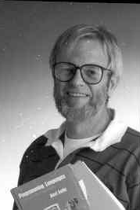
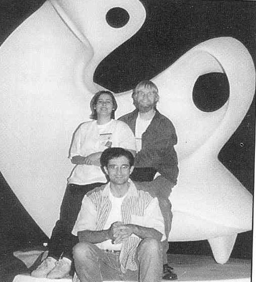
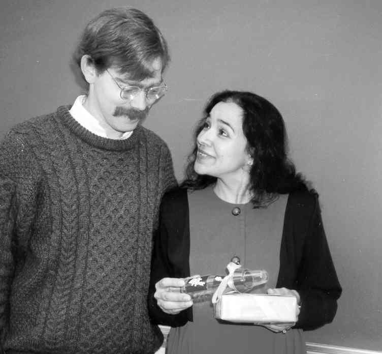
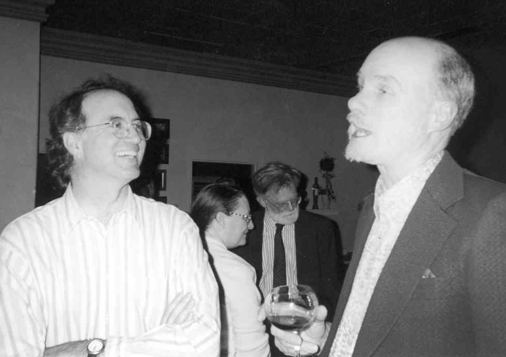

1993-2000 Department Chair-Jim Beug
===================================

Introduction
------------

As Jim Beug took over the Chair of the Csc Department, there were 450
undergraduates, 70 graduate students, 22 full time faculty and 10
lecturers. Cal Poly’s Computer Science Building was renamed the Frank E.
Pilling Building in recognition of the 1950 engineering alumnus who
donated $1 million to the College of Engineering. Pillings gift
established an unrestricted endowment to the College of Engineering. The
earnings generated from the donation will fund increased interaction
with industry, support for high technology classrooms and enhance
professional development by the faculty.

Over 250 computer science alumni have listed themselves on the alumni
web page by using www.csc.calpoly.edu/alum or www.csc.calpoly.edu.

Jim Beug, Computer Science Department Chair.

Accreditation
-------------

In 1997, the College of Engineering received reaccreditation from the
Accreditation Board for Engineering and Technology (ABET) across all
programs, including two new programs, Computer Engineering and
Manufacturing Engineering. The Computer Science Department received
continuing accreditation from the Computer Science Accreditation
Commission.

J. L. Moore Funds Ph.D. Study
-----------------------------

J. L. Moore who took computer science classes at Cal Poly 15 years ago
has made a bequest which will enable selected Cal Poly students to study
for Ph.D. degrees in Computer Science. The bequest of $1 million
includes an immediate endowment of $600,000, the income from which will
provide fellowships to several students a year.

According to the wishes of the donor, recipents will be determined by a
committee of professors from Cal Poly’s Csc Department. Because Cal Poly
offers no Ph.D. programs, recipients will use the funds to study at
other universities or come as Ph.D. candidates to perform applied
research at Cal Poly.

### Bellardo and Hamerly

Greg Hamerly (Csc 1999) and John Bellardo (Csc 1999), are fellowship
awardees of the first J. L. Moore Fellowships for doctoral study in
computer science. A committee of Computer Science Department faculty
selected these outstanding students based on academic achievements and
professional goals. The J. L. Moore Fellowships were established to
address the nationwide shortage of computer science Ph.D. candidates.
Undergraduate students often decide against doctoral study, weighing
their immediate income potential against the time and cost of graduate
school. The fellowships offer students the opportunity to attend the
doctoral program of their choice and to focus their time and energy on
their studies. Both fellowship recipients said they are grateful to be
able to pursue their degrees without constant concern over funding.

Mr. Bellardo was drawn to further study through his varied experiences
interning at several corporations and working as a Teaching Associate
for the Computer Science Department. "I realized I enjoyed doing
theory and research," Mr. Bellardo said. "I’m interested in pursuing
knowledge and sharing it with others." Mr. Bellardo plans to focus on
distributed computing and parallel processing. He is keeping his
employment options open: "I like teaching, but I may do corporate
research and development." Mr. Hamerly also expressed the desire for
deeper learning: "I feel like there is more that I can learn about
computer science in an academic setting."

Mr. Hamerly plans to work in numerical analysis and distributed
computing. Though he says he may teach, he is currently leaning more
toward industry.

Dr. Elmo Keller, chairman of the Csc graduate committee, expressed
confidence in the new fellows: "These two are excellent students with
outstanding academic records and will have a great career as computer
scientists." Both students will attend the University of California at
San Diego.[^19]

### Joseph L. Moore Fellowship

In a notarized letter sent to the California Polytechnic State
University Foundation on 23 December, 1996, Joseph L. Moore established
the J. L. Moore Fellowship. We include a paragraph from his letter.

> This one million dollar donation to the California Polytechnic State
> University Foundation is given to establish a quasi-endowment to
> provide funding for the J. L. Moore Fellowship. The income on this
> quasi-endowment and as much of the principal as needed will be used
> each year when and if one or more worthy or gifted post-graduate
> students are selected who have been admitted into a Ph.D., program to
> study for his or her Doctorate degree in computer science. The
> selection of the recipients of this fellowship and the amount of each
> award will be determined by the J. L. Moore Fellowship Committee to be
> established by the Computer Science Department at California
> Polytechnic State University. The members of the J. L. Moore
> Fellowship Committee will be professors in the Computer Science
> Department. These funds are to be used only in compliance with
> Internal Revenue regulations ...

He had requested to be an anonymous donor. On March 12, 2001, his great
nephew, Kevin Cavanagh, informed us that J. L. Moore had passed away on
March 8, 2001 and now the details of the fellowship could be published.

We feel very fortunate to have crossed paths with Mr. Moore in his
lifetime and to have been the beneficiary of his foresight and
generosity. His choice to endow a fellowship for advanced studies in
computer science will endure beyond our lifetime.

### Anonymous Donor Encourages Professionalism

The 1996-1997 Cal Poly College of Engineering Annual Report contains an
interview with a friend of Cal Poly, an anonymous donor. What follows is
part of that interview, with “anonymous donor” replaced with his real
name, Joseph L. Moore.

> Cal Poly’s friend doesn’t need recognition, he just wants young
> computer scientists and engineers to pursue the highest levels of
> professionalism. Fifteen years ago or so, well after he retired as a
> senior electrical engineer in a Los Angeles firm, J. L. Moore took
> computer science classes at Cal Poly.
>
> “Of course throughout my career, I used a hand-crank adding machine –
> I should give it to the Cal Poly Museum,” he smiles, “but I wanted to
> learn new ideas, so I took lots of programming classes, Basic, Fortran
> and COBOL. I had Dr. Curtis Gerald for several courses, the most
> wonderful man, you could ask him any question and he would carefully
> and patiently explain the answers to you. I’d lie in bed at night and
> figure out a programming problem and get up in the morning, drive to
> campus to record the program on punched cards – they’re outdated now,
> so I guess I’ll have to go back for more classes,” he teased.
>
> Joseph hopes that by setting up a generous fellowship, he can
> encourage students to seek doctorate degrees. These days, he enjoys
> his small patio in Arroyo Grande, especially when the ocean breezes
> soften in the warm afternoon light. Then he might putter a bit, fixing
> and building electrical gadgets, picking yellow lemons off his tree.
> But often, he sits thinking about the future, his ideas, his long
> life.
>
> He lived for much of his career overseas in England, Austria, and
> Germany where he founded a company that sold electrical equipment to
> U. S. contractors. After returning to the United States, Joseph worked
> as an electrical engineer for several firms. He was responsible for
> the electrical design of numerous projects such as Atomic Energy
> Commission test facitities, a radiation bleed-down plant for Lawrence
> Radiation Laboratories, the Apollo vehicle assembly building, a
> missile servicing facility, and many others.
>
> Recalling his years overseas, he speaks of the German culture that he
> came to love, its respect for learning, its “gemutlichkeit,” which
> means roughly an appreciation of shared ideas. “Germans are
> particular,” he says, putting emphasis on the word. “They like
> precision, things done well. I guess, as an engineer, I do too. I
> especially like the way they revere learning and advancement – that is
> why I want to see more Americans titled Herr Doctor.”
>
> “What is important,” says Joseph L. Moore, “is that young people have
> a goal in life and keep plugging at it. You know, I sometimes lay
> awake at night trying to figure out the future, and it’s beyond
> comprehension. But I never want to stop learning.”

Professor James Beug in a classroom in the Computer Science Building.

Faculty News
------------

### Faculty Additions

A nationwide search for new tenure track faculty has resulted in
additions to the Computer Science Department. Mei-Ling Liu and Emilia
Villarreal joined the faculty in September, 1994, with Lewis Hitchner,
Sigurd Meldal, Erika Rogers, and Chris Scheiman coming to Cal Poly in
1996-1997.

Lewis Hitchner, whose research interests are virtual reality,
interactive graphics, and digital image processing, joined the faculty
in Fall 1996, following three quarters as a visiting lecturer. He has
previously been both a faculty member at UC Santa Cruz and a researcher
at NASA Ames Research Center.

Sigurd Meldal came to Cal Poly in fall 1997 after serving as a Visiting
Professor at Stanford University, and Chair of the Department of
Informatics at University of Bergen. (Norway) His area of interest is
software engineering and design of distributed software architectures.
Dr. Meldal, an editor of the “Nordic Journal of Computing”, published
one book and several papers.

Erika Rogers, an Associate Professor at Clark Atlanta University, in
Georgia joined the Cal Poly faculty winter, 1998. Her research interests
emphasize the use of cognitive science and artificial intelligence
techniques for developing cooperative intelligent agents for visual
problem-solving. Erika who worked in industry for several years brought
to Cal Poly several collaborative funded projects, including the
prestigious National Science Foundation, POWRE (Professional
Opportunities for Women in Research and Education) Program grant.

Chris Scheiman whose area of research is in distributed computing
received a joint appointment with the Csc and EE departments. He
recently completed a post-doctoral research assigment at UCSB.

### Retirements

Retirements have included some senior members of the department. Daniel
Stubbs is pursuing his interest in writing and will retire effective
Fall 1997. Emile Attala retired Spring 1997 and will do part time
consulting in the computer industry. Ron Oliver has fulfilled one of his
lifetime goals by retiring to the mountains of Colorado effective summer
1997. Patrick Wheatley entered early faculty retirement program in
Spring 1998 and will teach half time for up to 5 years.

Microsoft Donation Funds Laboratory
-----------------------------------

Thanks in part to the outstanding job performance of our alumni at
Microsoft Corporation, the Computer Science Department was the recipient
of $100,000 gift from Microsoft to provide Windows NT based computers
and software for a database laboratory. Students in database courses
taught by Laurian Chirica and Emilia Villarreal have benefited by the
donations of Microsoft, Oracle and Borland which helped provide a
“hands-on” experience to solve database problems, and DBMS design and
implementation problems.

Computer Graphics Laboratory
----------------------------

The graphics laboratory has now become the most powerful workstation lab
on the Cal Poly campus thanks to the generosity of Silicon Graphics and
others. We now have 14 Indys, each with 96 MB of memory, several with
R5K processors, and two with Indy Video boards, plus the Presenter
projection panel used for class demos. Silicon Graphics has been very
generous to the College of Engineering, donating more than $200,000 in
equipment in recent years.[^20]

Professor and author, Mei-Ling Liu, teaching about her favorite subject,
distributed computing.

Core Language Change to C++
---------------------------

In spring of 1995, the faculty of the Computer Science Department, voted
to switch the core language from Ada to C/C++. This decision was based
on feedback from employers, alumni, students and faculty concerns that
students were ill prepared for upper division courses, many of which are
C++ based. The department believes that exposure to multiple language
paradigms is educationally important

The change over is being phased in over the 1995-96 academic year, with
Professor Clint Staley teaching the first section of Csc 118 in C++ in
Summer of 1995. It will be phased into the rest of the core courses
during the fall and winter quarters, with the changeover being completed
by spring 1996. A faculty core sequence committee consisting of Lois
Brady, John Connely, John Dalbey, Len Myers and Clint Staley is managing
the change.

Alumni “Medallion” Award
------------------------

Dan Weeks, (Csc 1983) was chosen by the faculty of the Computer Science
Department for the 1995 College of Engineering Medallion Award.[^21] The
award, the highest honor conferred by the College of Engineering,
recognizes alumni who have demonstrated \`"above and beyond\`"
commitment to the succcess of the College department, programs and
activities. Dan has served as the primary liaison between the department
and Hewlett-Packard and has helped facilitate more than $1 million of
equipment awards to the department in the last six years. Dan is
currently the System Reliability Section Manager at Hewlett-Packard in
San Diego and is heavily involved in recruiting Csc majors for HP. Dan
has also been a favorite speaker for the senior seminars each year and
retains \`"close ties with the faculty and students. He was recently
chosen as the first chair of the newly formed Computer Science
Industrial Advisory Council. In this distinction, Dan, joins David
Intersimone. (Csc 1973) of Borland International the department’s 1994
honoree.

Dan Weeks, (Csc 1983) College of Engineering Medallion Award winner for
1995.

1999 ACM Programming Competition
--------------------------------

The Cal Poly Gold programming team beat out 44 other collegiate teams to
place second in the Association for Computing Machinery (ACM) Southern
California Regional Programming Contest on Nov. 14, 1998. The team,
consisting of computer science graduate student, Bob Mathews, computer
science undergraduate, Vania Maldonado, and physics undergraduate, Ray
Lee, will advance to the World Finals of the ACM International
Collegiate Programming Contest held in Eindhoven, The Netherlands, on
April, 12, 1999.

Special thanks go to the team’s coach Kathleen Luce, an Operating System
Analyst with ITS on campus. Ms. Luce brought valuable insight, since she
competed on the Cal Poly team at the 1993-1994 World Finals during her
student days. Ms. Luce explains, “I felt excited to participate again in
something that meant so much to me as a student.” She volunteered her
time to practice sessions and simulated contests that lasted up to five
hours with progressively difficult problems.

Kathleen Luce, Coach of the 1999 ACM programming team.

Cal Poly programming team beat UC Berkeley, Harvard, and Harvey Mudd to
capture sixth place in the international ACM competition held at
Eindoven University, The Netherlands, with 62 teams from around the
world competing. The field was narrowed from 1,457 in regional
competition.

Computer science students Vania Maldonado and Bob Mathews, and physics
student Ray Lee were the second hightest-scoring U.S. Team in the World
Finals; Duke University finished one place higher, coming in fifth. The
teams finishing in the top four were University of Waterloo in Ontario,
Canada; Alberg Ludwigs University, Freiburg, Germany; St. Petersburg
Inisitute of Fine Mechanics and Optics, Russia and the University of
Bucharest, Romania.

Cal Poly Gold Team, Vania Maldonado, Bob Mathews, and Ray Lee.

The Cal Poly team solved five of six problems in the allotted five
hours, incurring the fewest penalty points of the top ten finishers.[^22]

Computer Science Advisory Council 
----------------------------------

The Computer Science Department formed its 1995 Industrial Advisory
Council . The council’s goals are to:

-   help keep the department up to date on current and future needs of
    graduates;

-   assist the department in developing and implementing its goals;

-   create an opportunity for the department to exchange ideas with
    people in industry;

-   help industry leaders better understand the department’s mission;
    and assist the department in seeking public and private support.

Current members are: John A. Adelsbach (Tektronix), James Basiji (3Com
Corporation), Richard Bergquist (Peoplesoft), Peter Bradshaw (Xerox),
Jerry L. Brown (Tandem Computers Inc.), Linda M. Burt (Silicon Graphics,
Inc.), Kathy A. DeMartini (PDH, Inc.), Bert Forbes (Ziatech
Corporation), Mark S. Gerhardt (Loral Space & Range Systems), David F.
Hastings (Pacesetter, Inc.), David G. Intersimone (Borland
International), David W. Mitchell (Chevron Information Technology), Emil
Sarpa (Sun Microsystems Labs), William Scott(Hewlett-Packard), and Dan
M. Weeks (Hewlett-Packard).

Dan Weeks and David Intersimone, both Computer Science alumni, are
co-chairing the council. This past year they have reviewed our
curriculum with respect to industry needs, and reviewed laboratory and
resource needs.

Distinguished Teaching Award
----------------------------

He’s been known to eat chalk to get their attention. Students who arrive
late may be asked to dance before they take their seats. But more
importantly, he’s well prepared, makes interesting presentations, and
explains things well. This is why Computer Science Professor Len Myers
received one of Cal Poly’s prestigious Distinguished Teaching Awards
announced at Commencement in June, 1998.

Dr. Myers believes in making class time count. He spends a lot of time
thinking about the methods used in the classroom, not just the material
to be presented. He works hard to \`"make class special‘" so students
will want to attend class every day, on time. While some of his methods
may seem a little goofy, he says they help bring the class together,
create a good mood, and make the class worth attending. Students in Dr.
Myers’ classes have no choice but to be involved.

Outside the classroom, Dr. Myers is known as a caring individual, who
takes time for people who want to talk. He counts among his greatest
contributions the counseling he has provided to students who want to
make changes in their lives. Even parents write to thank him for his
extra personal interest in their sons and daughters.

When asked if his visiting professor position at the U.S. Air Force
Academy had an effect on his nomination and award this year; Dr. Myers
hesitated. \`"The experience at the Air Force didn’t change what I’ve
been doing for many years,\`" he said, \`"but it did affirm my beliefs
and give me more confidence to do what I believe in.\`"

Nominations for the Distinguished Teaching Award were made by alumni and
students. Dr. Myers’ courses were visited by five faculty and two
students over the course of two quarters. Evaluators also considered
written background material.

Dr. Myers has received an \`"Apple Polisher\`" designation from the Poly
Reps, and a certificate for outstanding teaching from the residents of
Tenaya Hall this year.

Oh, by the way. Eating chalk? It’s really stick candy planted in advance
in a chalk box. So far he hasn’t mixed it up with the real thing.[^23]

Csc students help develop Web-Based Course Registration
-------------------------------------------------------

In the ongoing effort to improve student services, Cal Poly unveiled the
new Poly WEB Registration system (POWER) in March. The new system
successfully processed 80,000 on-line registrations in its debut.
Computer Science graduates Scott Wehrmann (BS Csc 1999) and Jeff Caddel
(BS Csc 1997) were instrumental in the design and implementation of the
pioneering service.

Mr. Wehrmann began his work on the POWER programming team for his senior
project under Dr. Sigurd Meldal. Mr. Caddel and Mr. Wehrmann, coworkers
at Information Technology Services on campus, collaborated with staff
members from Academic Records to develop an expanded on-line service.
POWER allows students to create schedules based on open class
information and then complete their registration on the Web. Students in
the residence halls have been testing POWER since Fall of last year.
POWER is currently accessible from remote locations as well as
dormitories and on-campus labs.

The Web-based registration system has proven immensely popular and
analysts predict the system will receive approximately 2,000,000 hits
monthly. There are already plans to extend the service to include
additional information such as textbook requirements, and increased
options such as the ability to make course selections by general
education area.

POWER works in conjunction with the CAPTURE telephone registration
system, offering students greatly expanded access to registration
services and information. POWER has also reduced phone calls to
Admissions and Records for simple registration queries. Now, students
can find the information they need quickly and easily.

Dr. Meldal, pleased with his senior student’s performance, noted,
\`"Scott’s project was essentially to put CAPTURE on the Web. And the
new POWER program has been quite successful. IBM even featured it on
their Web site as a Java success story.\`"

CENG Honors Gary Bloom
----------------------

In his eleven-year career with Oracle Corporation, Computer Science
alumnus Gary Bloom (Csc 1982) has developed and marketed an impressive
list of key technologies for the software giant. Now senior vice
president of the System Products Division, Mr. Bloom oversees the
development and marketing of Oracle’s core database technology and data
warehousing products. In recognition of his record of success and
achievement, the Computer Science Department and the College of
Engineering presented Gary Bloom with the 1999 Professional Achievement
Award.

Fellow alumni came to support Gary Bloom when he gave the keynote
address at the Computer Science Banquet in May, 1999. Left to Right:
Janet Morris (BS Csc 1982), Louis DeMartini, Pat Marsh (MS Csc 1982),
Kathy DeMartini (BS Csc 1982), Judy Marsh, Gary Bloom (BS Csc 1982),
Judy Bloom.

After graduating from Cal Poly in 1982 with his Bachelors degree in
computer science, Mr. Bloom worked in mainframe systems areas at IBM and
Chevron Corporation. Since joining Oracle, he has served as senior vice
president of the Worldwide Alliances and Technologies Division, senior
vice president of the Product and Platfonn Technologies Division and
vice president of the Mainframe and Integration Technology Division.
Successful products developed under his guidance include gateways
between Oracle databases and other data sources, parallel server
technology for massively parallel systems, and tools and packaged
applications on more than 90 hardware platforms.

Throughout his career, Mr. Bloom has maintained his relationship with
Cal Poly and the Computer Science Department. He recently gave the
keynote address at the Computer Science Awards Banquet and has been
actively involved with other Bay Area Computer Science Alumni.[^24]

Linux – A Free Unix
-------------------

In 1992, a talented programmer named Linus Torvalds took a small
educational version of Unix called Minix and rewrote and extended it. By
mid 1993, Linux had completely dropped its Minix roots and was becoming
quite a usable version of Unix. It was adopted with great enthusiasm by
other programmers on the Internet, and spread like wildfire. It soon
became the fastest growing version of Unix, mainly because it was free.
Linux ran primarily on x86 based PC’s, and it actually ran well even on
a slow 386 with 4 Mb of RAM and a 40 Mb hard disk.

Linus and his followers proudly described Linux as a programmer’s system
because it could easily be modified and it relied heavily on freely
available software which had been written by other programmers. Its
graphics system was the X Window System, which was freely available from
MIT. For its GUI it used a collection of freely available window
managers and other GUI components, which were also freely available.

Many of the programs which people actually used (the shells, the
compilers, the utility commands etc) came from the GNU Project - a free
software project started by Richard Stallman in the 1980’s. Stallman, a
talented programmer, was also somewhat “unusual” in that he passionately
believed all software should come with source code so that other
programmers could extend it. The ultimate goal of the GNU Project was to
create a completely free Unix-like operating system called GNU (which
stood for GNU’s Not Unix - a recursive definition!).

When Unix was young, version 6, the source code was widely available and
the Cal Poly operating system courses used it and the commentary
describing the code in a volume written by John Lions. When AT&T came
out with version 7, it realized that Unix was a valuable product, so it
issued a license that prohibited the source code from being studied in
courses.

For a few years at Cal Poly, we just studied the theory of operating
systems, until Andrew Tanenbaum wrote an ix86 compatible operating
system, Minix, like Unix on the outside, but completely different on the
inside. Since 1987, Cal Poly Computer Science Department used Minix, as
a case study with Andrew Tanenbaum’s book, “Operating Systems, Design
and Implementation”. He included the source code for Minix in the book
and available on disks, thus students could modify the source code and
construct “real type” projects on a PC compatible machine.

After Linux became available, it became the “case study” to analyze
algorithms and data structures in OS courses I and II. The Operating
Systems Laboratory, in 14-232, currently has 19 HP Kayak XA Pentium
II/450 machines bootable to Linux, Minux, or Windows NT. All machines
are fully network connected with laser printer facilities.

Baby shower for Chris and Millie in January, 1995.

Gene Fisher directing the research of a student, Makram Abu-shakra.

Core Language Changes to Java
-----------------------------

### Why Java for the Core Sequence

Starting Fall 2000, the core sequence courses, Fundamentals of Computer
Science I, II and III, (CSc101, CSc102, CSc103) of Cal Poly’s Computer
Science Department will be using Java as the programming language,
replacing the previous language, C++ which has been the core sequence
course language since Fall 95.[^25] Since then, Java has emerged and
matured as a widely accepted programming language.

### Pedagogical Justifications for the Change 

-   The syntax of the language is “cleaner” and simplified compared to
    C++.

-   The interpretive nature of the language supports better run-time
    error diagnostics.

-   The built-in exceptions handling constructs of the language will
    help to promote good programming practice.

-   The language has an extensive and established foundation class
    library. Graphics can be introduced with relative ease.

-   It is a language that promotes software reuse and rapid software
    development.

-   Java has already been adopted for a large number of upper-divisional
    courses offered by the department.

-   Applets can be run using browsers over the Internet, potentially
    enhancing student interest, and also simplifying the system support
    issue. ( Java is platform independent. The basic development
    software, the Java Development Kit (JDK), is free, and the language
    is designed to run via a platform-independent virtual machine. Hence
    students who own PC’s should have easy, low cost access to a
    software development environment which is compatible with that
    adopted by the department, and which may consume less hardware
    resources.)

-   There exists an academic integrated development environment, Kawa,
    which has already been used on other campuses with good results.

### When Will the Change Take Place?

Starting Spring 2000, CSc101 will be taught using Java. Starting Summer
2000, all core courses will be taught using Java. Java is a language
that has a lot of similarities with C++. Students who have completed a
core course in C++ should only need to make small adjustments to use
Java as the programming language in the follow-up course. Moreover, your
instructor will provide help at the beginning of the quarter for you to
make the adjustment.

A number of upper divisional courses have already been using Java as the
programming language; students who are proficient in C++ have not had
problems making the transition. Typically, an instructor will provide
programming samples and handouts to help you make the transition.

John Dalbey and Lew Hitchner at a Computer Science Department party and
Pat Wheatley in the background.
