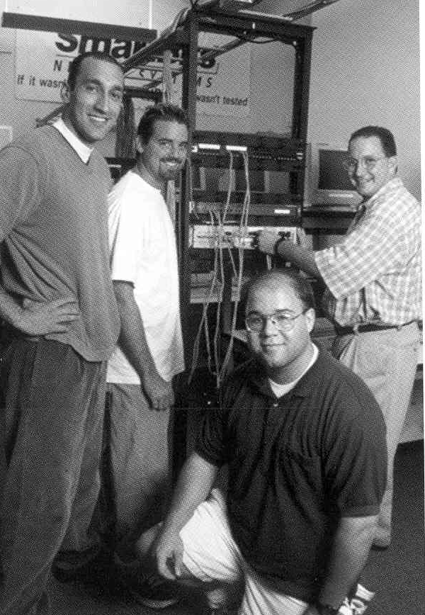
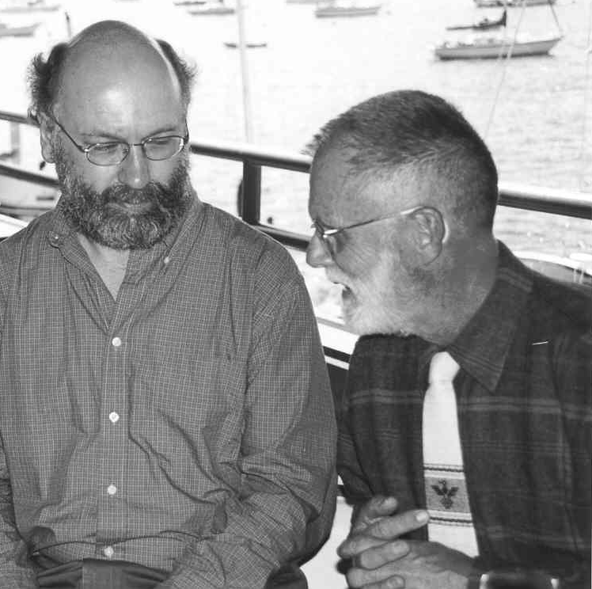
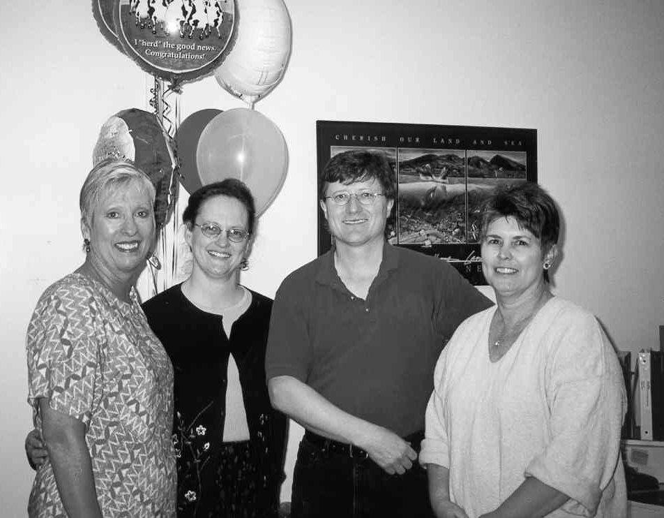

2000-2001 Department Chair-Sigurd Meldal
========================================

Exciting Times or What?
-----------------------

In my hand I hold a small piece of equipment - say the size of a quarter
or so, and as light.[^26] When I slip this sliver of a thing into my
camera (or into my laptop computer), I gain one gigabyte of storage
space. The little microdrive is a 4500 RPM hard disk. Give me a couple
of those and I can store all the documents I have ever created across
the length of my professional life.

For a romantic such as myself this is mind-boggling: Moore’s law in
action, and so tangibly so. The technology development underlying our
profession has only one direction - forward, and only one speed – full
tilt. What goes for the profession holds for the department as well. The
students, faculty and staff are enjoying this ride into the future
together. Together with our alumni and industrial partners, we are
providing future computer science and computer engineering professionals
with a solid foundation in their profession, coupled with a true can-do
attitude when faced with new challenges.

Department Chair, Sigurd Meldal, meeting with the Computer Science
Department Industrial Advisory Board.

We have enjoyed a successful start of this academic year, with US News &
World Report ranking the department first in the nation among primarily
undergraduate computer science departments. One aspect of our success is
the superior adaptability of our curriculum. While ensuring that all our
graduates possess the core competencies of successful computer
professionals, the department is continuously evaluating our strategic
direction, modifying and improving our curriculum as needed.

I would like to draw your attention to two new areas of development:
bioinformatics and software engineering. In the field of bioinformatics
we see the synergy of two exploding research and development areas:
computer science and molecular biology. The potential for improving the
human condition arising out of this field is immense, and computer
systems comprise a core, enabling technology for the mapping and
analysis of genomic material.

Closer to the core of our profession, the department is creating a new
major in Computer Software Engineering. Taking the best of Cal Poly’s
\`"learn-by-doing\`" tradition and the excellence of the established
Computer Science and Computer Engineering programs, we are creating a
software-oriented engineering program that retains the solid foundations
of the existing programs, adds more mathematics and engineering science,
and tops it off with an introduction to the challenges and joys of
technology team management. Students will engage in large-scale,
client-oriented systems development for real customers. They will also
make engineering tradeoffs while striving for that often elusive
engineering goal of delivering a significant software product on time,
on target and on budget. As we are enjoying a strengthening of support
from industry and alumni, I invite you to join us in the exploration of
these new directions, and in maintaining the high quality of our
existing programs and offerings.

Cisco Advanced Network Lab
--------------------------

When Cisco’s Chairman of the Board John Morgridge came to Cal Poly to
dedicate the Cisco Systems Advanced Network Laboratory, he paid tribute
to the Cisco employees and Cal Poly staff who made it all possible.[^27]
\`"In the computer industry, it’s easy to make that (university) contact
a check. But for partnerships, you need human involvement.\`"

Cal Poly benefited from that human involvement as Cisco representatives
and Cal Poly technology staff spent about six months planning the lab
and another six months assembling it in the Engineering East Building.
Much of the installation and setup of the facility was performed by Cal
Poly alumni now working for Cisco. \`"...for partnerships, you need
human involvement.\`" Barry Bruins (BS Csc 1983), a director of
engineering at Cisco, is enthusiastic about alumni involvement in the
project. ‘"By getting alumni involved with the networking curriculum, we
were able to make major improvements in the students’ knowledge of the
fundamentals of Internet technology,‘" Bruins said. ‘"These fundamentals
will help them in whatever area of the Internet economy they find
themselves.’’ The Cisco Advanced Network Laboratory replaced the old
networks lab and has allowed the network offerings in the curriculum to
expand. A new graduate computer networks course has joined the list
alongside the two undergraduate network courses. Besides Computer
Science and Computer Engineering students, the lab also serves the
College of Business network courses.

The laboratory configuration offers enough equipment for 32 students to
perform network experiments simultaneously, using switches, hubs,
routers with Voice Over IP as well as ATM, fast ethernet, token ring,
and ISDN capabilities. Cisco’s major support for the lab was enhanced by
donations from Intel and NetCom, bringing the total cost of creating the
lab to about $1 million. Bruins said Cisco looks forward to a
continuing, long-lasting relationship between Cisco and Cal Poly; and is
already seeing the benefits of the partnership. \`"Seeing students
excited about the technology and eager to apply their knowledge in the
industry is a reward in itself.\`"

There are currently about 300 Cal Poly graduates working for Cisco
Systems.

Professor Hugh Smith works with students in the Cisco Systems Advanced
Networks Laboratory, which allows 32 students to perform experiments
simultaneously. Left to right: Ali Torabi, Rob Collier, Terry Ott, and
Dr. Hugh Smith.

U.S. News and World Report
--------------------------

US News & World Report of September 11, 2000, published their annual
ranking of colleges, and this year they have also ranked departments.
The Csc department is found under the Engineering Departments/Computer
subcategory, and are ranked “number one” in the nation among the
undergraduate (non-Ph.D. granting) institutions.[^28]

Franz Kurfess and Pat Wheatley discussing a computer science issue with
backdrop of Morro Bay.

We quote here an email from Cal Poly University Vice President for
Academic Affairs, Paul Zing.

From: pzingg@calpoly.edu

Date: Fri, 1 Sep 2000 12:27:08 -0700

Subject: USN&WR Rankings

> Congratulations to all of you for the rankings that CPE and Csc have
> achieved in this year’s US News & World Report sweepstakes. Although
> the meaning and value of these rankings can be argued endlessly
> (especially by those not highly ranked), achieving \#1 is no mean feat
> under any circumstances. This recognition is a testimony to
> outstanding students, a dedicated faculty, and able leadership over
> the years.
>
> Cal Poly is grateful for what you have achieved. What the public (and
> legislature and Chancellor’s Office) do not completely recognize very
> well, though, is the magnitude of this achievement in the absence of
> needed resources. While Cal Poly is \#1 in academic reputation (a
> measure of a quality faculty) and selectivity (a measure of demand
> among high quality students), we are in the middle of the pack
> regarding resources. All the more impressive what you and your
> colleagues have achieved. Again, congratulations – for the firm
> foundations established and the clear challenges ahead.
>
> Paul

Staley and Stier Earn University Honors
---------------------------------------

Professor Clint Staley and Administrative Analyst Ellen Stier were
chosen as recipients of the highest university honors for outstanding
faculty and staff for the 1999-2000 year. Staley, legendary enough to
have a student-run web site devoted to him, was named Distinguished
Teacher. Stier, who was described as \`"the glue that holds the
department together,\`" was named Outstanding Staff. Each award is given
to only three employees each year.

Ellen Stier, Cal Poly Outstanding Staff Award Winner, 1999-2000.

Staley has taught computer science at Cal Poly since 1988 and has earned
numerous department and college teaching awards over the years. He is
described as \`"the toughest professor you’ll ever love,\`" and was
lauded for his ability to challenge students and bring real world
experience to the classroom. Staley teaches the accelerated introduction
to computer science, as well as object oriented GUI design courses.
Stier was honored for her \`\`wisdom and counsel\`" along with her job
performance. According to the Computer Science Department chair, Sigurd
Meldal, \`"She stands out by really caring about the department and
being aware of all the technical, professional and political issues that
affect our work.\`" Stier has been chair or member of many department,
college and university committees and is respected across campus. She
has been at Cal Poly since 1984.

Distinguished teachers are nominated by students and alumni of the
university, and selected by a committee of past awardees. Outstanding
staff are nominated by faculty, staff or students, and are also selected
by a committee of past awardees. Staley and Stier were both honored at
university-wide events during Fall 2000.

Office staff celebrating Ellen Stier’s Outstanding Staff award. Diane
Goldman, Ellen Stier, Sigurd Meldal; Department Chairman, and Haley
Landis.

Software Engineering
--------------------

To answer a growing need for practitioners who combine the best of
software development and engineering discipline, the Computer Science
Department has proposed a new Bachelor of Science Computer Software
Engineering (BSCSE) degree. The program, if approved at all levels of
the review process, could accept its first students as early as Fall
2003.[^29]

Back in the 1960s and ’70s most software development was about achieving
efficient calculation. The focus in software research and practice was
to create new programming languages and better algorithms: a
mathematical endeavor.

The increasing complexity and scale of today’s software has moved the
primary challenge of software construction from the details of efficient
code generation more towards component-based system construction and the
ability to make tradeoffs involving reliability, cost, time and even
safety. In order to make such tradeoffs in a responsible manner,
practical knowledge of engineering principles is a necessity. The field
of Computer Software Engineering has traditionally addressed the
problems associated with all aspects of the development of large-scale
computer systems.

Trends in software development also underline the important need for an
engineering oriented curriculum. Even simple programs involve many
thousands of lines of code. As a result, students must learn by
analyzing, modifying, and using existing software, rather than simply
writing small programs on their own.

Tools necessary for modern Computer Software Engineering have similarly
advanced. An editor and compiler are no more adequate for gaining a
professional mastery of software construction than the use of a home
chemistry set is for the teaching of industrial chemical or biological
processes. A standard industrial software systems project may require
thousands of dollars worth of development software, including databases,
middle tier libraries, GUT libraries, source-code control systems,
object-oriented design tools, and associated hardware such as dedicated
servers, computer networks, and workstations.

Furthermore, one individual, no matter how capable, can no longer
develop the complex software required to meet society’s demands. Most
software design and construction involves a complex engineering process,
and our students must learn to work effectively in teams in order to
succeed in the current market for software practitioners.

The majority of the graduates from the Computer Engineering and Computer
Science programs develop and/or maintain software applications. A large
proportion of the jobs today are in computer software applications
development, i.e., Computer Software Engineering. Cal Poly surveys each
year’s graduates, achieving a representative sample of their
professional direction. Of those surveyed, 40% were employed as Computer
Software Engineering professionals, even though their degrees were in
computer science or computer engineering.

In many respects, the establishment of a Bachelor of Science Computer
Software Engineering degree constitutes an identification and labeling
of an existing curricular path in a growing discipline. The Computer
Science Department has offered a sequence of courses preparing students
for a Computer Software Engineering profession for a number of years,
and has recently added three new courses specifically addressing the
students’ need for management experience, providing them with an
emphasis on the engineering of computer software development. The
Computer Software Engineering degree differs from the Computer
Engineering and Computer Science degrees in significant ways:

-   The CSE classes place an emphasis on software processes and
    lifecycles.

-   The CSE classes include significant learning in engineering and
    management areas (software quality assurance, testing, software
    metrics, maintenance issues, configuration management, and personnel
    management).

The curriculum includes a year-long capstone sequence where the students
work in teams to build a large software system. Students are required to
complete a co-operative education experience prior to enrollment in the
capstone courses.

Erika Rogers working with students in her laboratory.

A unique feature of the capstone courses is their integration with lower
division courses. The laboratory periods of the upper-division sequence
are integrated with sections of the lower division sequence. The senior
Computer Software Engineering students work in teams to build deployable
software, and the teams will be made up of students from both the upper
division and the lower division courses. Thus the upper division
students will also serve as technical and administrative leaders for the
lower division students on their teams.

Faculty Transitions
-------------------

Tim Kearns, whose research interests are database systems, data
warehousing, and data mining, joined the faculty in 2001. He also works
with the biology department to build stronger set of courses in
bioinformatics and biotechnology. Tim earned his Ph.D. from University
of Notre Dame. His career has included technical and management
positions at AT&T’s Bell Labs, Hewlett-Packard and Price Waterhouse. He
had a prior appointment at Cal Poly in the 1980’s.

Associate Professor Franz Kurfess was drawn to Cal Poly because teaching
is taken seriously here. He has added depth to the department’s
expertise in artificial intelligence, and specializes in knowledge
organization management and neural networks for knowledge
representation. Franz received his Ph.D. from Technical University in
Munich, Germany. He came to Cal Poly from Concordia University in
Montreal, Canada.

Associate Professor Hasmik Paulson’s interest are in numerical methods
and computer science theory. She completed her Ph.D. in the former USSR,
where she taught at Yerevan State University in the Republic of Armenia.
She has continued her work on the numerical solutions of integral
equations.

One reason Professor Hugh Smith enjoys Cal Poly is industry’s enthusiasm
for the computer science and computer engineering programs. He helped
shape the new network lab as it was being developed at Cal Poly and
Cisco and now takes full advantage of the technology in his courses.
Hugh earned his Ph.D. from Michigan State University. He is the advisor
to the student chapter of ACM.

Clark Turner uses case studies to teach students in the “Professional
Responsibilities” course that technical aspects are inseparable from
social and ethical aspects of engineering. With a law degree from the
University of Maine as well as a Ph.D. degree from UC Irvine, Turner was
named Csc Professor of the year in his first year of teaching in
1999-2000. He is the advisor of the Linux User Group and is working with
a team of engineering students and faculty to build and launch a
satellite.

Former CPE director, Joe Grimes, now Special Assistant to the Provost
for Faculty Development and Industrial Relations, continues to stay in
touch with faculty and students by teaching part-time. Len Myers is now
associate director of the CPE Program working with Director, EE
Professor, Art MacCarley.

Long time faculty members, Elmo A. Keller, John Connely and Ray Boche
have entered into the faculty early retirement program, which allows
them to be involved with the Csc faculty and students while teaching
part time.

Key faculty in the software engineering program. Left to right: Clint
Staley, and Gene Fisher.
