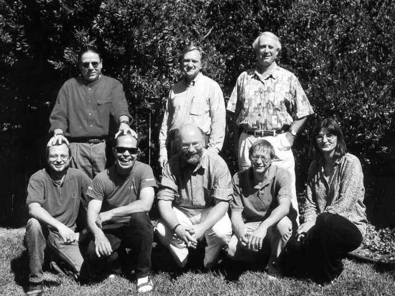
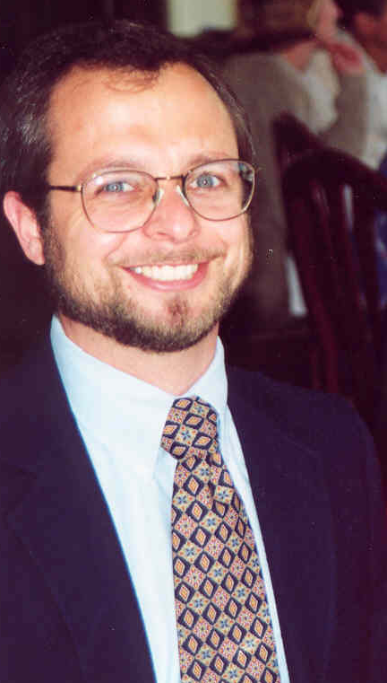
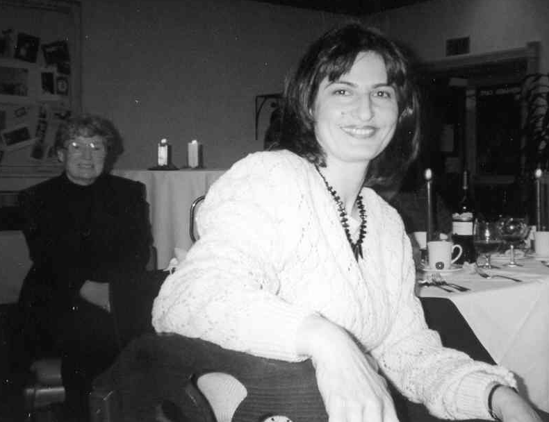

2001-2005 Department Chair-Tim Kearns
================================

## Executive Summary (er, so to speak)

Tim Kearns was department chair for four years, from 2001 until
2005. The first year of his tenure is well-documented, since Elmo
Keller wrote a great summary. Sadly, that's the last text that he
added to the Computer Science Department History, which leaves
a gaping gulf of 13 years.

Lacking the time and energy to do a better job of editing this text,
I'm going to leave the existing (2001) text intact. Here it is!

Challenges and Opportunities
----------------------------

The new year has brought a number of new challenges and opportunities to
the Computer Science Department.[^30] Prof. Sigurd Meldal, who has
provided such strong leadership to the department, has left to lead the
Computer Engineering program at San Jose State. His energy and
initiative will be greatly missed. In addition, a few of our most
experienced faculty are preparing for a well-earned retirement by
reducing their teaching loads. To meet this challenge, the department is
carrying out an extensive effort to recruit energetic new faculty
members to carry on the department’s tradition of educational
excellence. Perhaps the department’s greatest challenge is the slow
erosion of funding for education in California. In recent years, reduced
funding has forced us to increase class sizes and faculty workload. If
the trends of the past decade continue, Cal Poly’s reputation for
excellence in undergraduate education will be in serious jeopardy. To
meet this challenge, the department, in partnership with the College of
Engineering and the university, is undertaking a number of initiatives:

-   Developing additional sources of funding from individuals and
    companies. The past two years have given us an excellent start
    through donations for endowed chairs and improvements to our
    laboratory infrastructure. We need support to build on this
    excellent beginning.

-   Forming a stronger partnership with students by asking them to
    participate more actively in department affairs and supporting
    excellence in education through an increase in student fees.

Our goal is to continue to improve the reputation and increase the value
of a Cal Poly degree. We can do this by hiring excellent faculty,
attracting excellent students, and working with students to increase
their involvement and commitment to educational excellence.

Tim Kearns as Department Chair.

Tim Kearns handing Diploma to future CSC faculty member Foaad Khosmood (2004)

Summary of Last Two Years
-------------------------

A summary of good things happening to the Computer Science Department
the last 24 months.

-   A $3 million gift from Bert and Candance Forbes established two
    joint endowed professorships and a lab endowment fund for CSC, CPE
    and EE.

-   An anonymous donor provided the first five planned yearly gifts of
    $100,000 to support the computer software engineering curriculum.

-   Mr. and Mrs. Al Yackle donated $30,000 in scholoarship funds in
    memory of their son, Brad.

-   Cisco, Intel, and NetCom collaborated to establish a $1 million
    networking laboratory.

-   Compac upgraded the Tandem Systems Laboratory with 20
    state-of-the-art workstations and funded $20,000 project on a static
    analysis tool.

-   Raytheon awarded the faculty and students $120,000 in research and
    development contracts.

-   Professor Clint Staley received the Cal Poly Distinguished Teacher
    Award for 2000.

-   Ellen Stier received the Cal Poly Outstanding Staff Employee Award
    for 2000.

-   The Computer Engineering program received 1043 applicants for 102
    freshman positions.

-   The Computer Science program received 1598 applicants for 121
    freshman slots.

-   Art MacCarley completed his first year as Program Director of
    Computer Engineering; Len Myers was appointed Associate Director.

-   The average SAT score of entering freshmen was 1347.

Biology Meets Computer Science
------------------------------

The sequencing of the human genome is a thrilling achievement. It has
been likened to landing on the Moon, splitting the atom and even
inventing the wheel.[^31]

Bioinformatics is a fast growing discipline that combines molecular
biology with the computational and physical sciences. Its focus is the
development of computer tools and models to generate, organize and
analyze biological data and model biological processes. Now that the
sequencing of DNA molecules that makes up the human genome is complete,
the exciting work of analyzing and using that data for new diagnostic
tools and treatments for human illnesses will accelerate.

Data on the structure of DNA and protein molecules in human and other
species continues to improve our understanding of biological processes.
This new understanding promises to revolutionize fields as diverse as
agriculture, medicine, and law enforcement. At the same time, these
advances have raised computational and storage problems that require
sophisticated tools and models. The Cal Poly Computer Science Department
(collaborating with the Biology Department) is offering a course series
in bioinformatics designed for computer science and biology students
interested in understanding the tools being used to solve these
biological problems. The courses include labs where biology and computer
science students work together on bioinformatics projects. This has
expanded opportunities for students to work in multi-disciplinary teams
and increase their understanding of other domains outside their major.
Professors Sigurd Meldal and Tim Kearns have led the effort from the
computer science side. Students from the courses have already accepted
positions in bioinformatics at leading edge biotechnology
companies.[^32]

New Faculty and Mentors. Back row: (Mentors) Gene Fisher, Len Myers, Dan
Stearns. Front row: (New Faculty) Phil Nico, Clark Turner, Franz
Kurfess, Tim Kearns, Hasmik Paulson.

Computer Systems Lab Renovation
-------------------------------

A vision for the future of computer science and engineering education is
one step closer to reality with a major gift from electrical engineering
alumnus Paul R. Bonderson, Jr. His gift will establish the Bonderson
Advanced Software Design Studio, a flexible modern laboratory where
effective, interactive teaching can occur.

Phil Nico carries on the Unix tradition at Cal Poly Computer Science
Department.

In addition to developing the software design studio, the gift to
computer science will be used to begin a major renovation and upgrade of
the existing Computer Systems Laboratories (CSL). The preliminary design
process has begun and an architect is being engaged to prepare
blueprints. In the new CSL, lab sizes and orientations will be flexible;
the machine room will be upgraded; office, meeting and storage space
will be enhanced; and hallways will be built to accommodate future
expansion toward Dexter Lawn. Air conditioning and lighting are slated
for replacement and raised floors and carpeting will be installed.

Master of Ceremonies, Erika Rogers, introducing graduates at the 2002
Computer Science Department Spring Commencement Ceremony.

Depending on when they graduated, alumni may remember the old CSL
consisting of only part of the downstairs of the North wing of the
Computer Science Building. The current CSL consists of all of the rooms
on both the first and second floors. The addition of an elevator in
recent years made the upstairs space more accessible. The Bonderson gift
will allow the department to take a quantum leap in terms of modernizing
the space and making it usable for the interactive teaching modes used
throughout the curriculum.

Clark Turner at a faculty dinner in 2002, in the background to the left,
Ray Boche and Chris Buckalew.

In addition to $1 million for the computer science lab renovation
projects, Bonderson also gave $5 million to the College of Engineering
Project Center, a multi-discipline senior projects building.

Bonderson is vice president of engineering and the co-founder of Brocade
communications Systems Inc. He serves on the College of Engineering
Dean’s Advisory Council and the College’s Centennial Campaign Committee.
He was the college of Engineering Honored Alumnus for 2001.[^33]

Old Soldiers fading away. Retirement dinner for Charles Dana, Elmo A.
Keller, John Hsu, John Connely, and Ray Boche held June 8, 2002 at the
Veranda Cafe on the Cal Poly Campus.

Lois Brady and Hasmik Paulson enjoying a department dinner.

