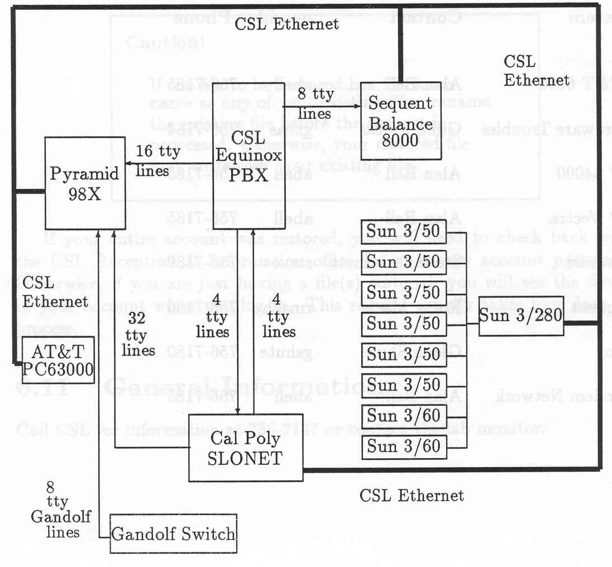

Computer Systems Laboratory
===========================

History of CSL
--------------

In the school year of 1977-1978, Emile Attala formally established the
Computer Systems Laboratory with 375 square feet of space and one
technician, Ralph Nicovich, allocated with Jay Bayne as the faculty
director. By Spring quarter 1983, the space had grown to 1800 square
feet by the addition of 14-238 and the space doubled later in the summer
with the addition of 14-235. By 1983, the CSL staff maintained the
computer literacy facilities, the faculty office systems and the
department computer systems as well as CSL software and hardware.

By May, 1985, CSL consisted of a half-time faculty Director and a
technical and administrative support of four. Approximately 1.5 of the 4
positions are for hardware maintenance and support, 2.0 for system
software support, and 0.5 for administrative support. There is 4,200
square feet of floor space, including a well equipped repair and
maintenance shop. CSL houses over $2 million worth of hardware and
software.

As of 1985, the CSL Advisory Committee consisted of Beug, Grimes,
Keller, Hsu, Stubbs, and Webre with Joseph Grimes as the Faculty
Director. Staff members Gilbert Keas, and Haley Landis handled software
support with Neal Pollack dealing with hardware and Alan Bell as
software manager. Daniel Stearns followed Joseph Grimes in 1985 as
Faculty Director of CSL.

Don Erickson, CSL Director since 1987.

Neal Pollack left Cal Poly in the Spring of 1987, and the department
hired Don Erickson for CSL manager. Don, our current manager, commented,
“that every piece of equipment since he started has been replaced and
every network restructured.” He estimates that the equipment in CSL is
worth over $10 million. Ron Oliver, and Chris Buckalew have served as
Faculty Directors over the years as well as various Department chairmen.

Mission Statement
-----------------

The mission of the Computer Systems Laboratory (CSL) is to provide
equipment, facilities, and support for the instructional and research
objectives of the Computer Science Department, including Computer
Engineering and Software Engineering programs.

CSL Manager
-----------

The CSL manager is responsible for:

1.  Overall supervision of the CSL.

2.  Long and short range planning and budgeting.

3.  Outside liaison.

### Maintenance

All hardware maintenance is done in-house. A well equipped workshop is
available. Hardware maintenance contracts are not cost-effective. The
service of a field engineer has been required only three times in past
six years.

Software maintenance contract is maintained for HP product. A limited
software maintenance contract (OS only) is maintained for SUN equipment.
CSL maintains computers (hardware and software), network connection, and
printing facilities for all faculty, teaching assistants, and staff
offices.

1988 CSL staff members, Left to Right: Gilbert Keas, Haley Landis, and
Alan Bell.

1988: CSL Equipment and Networks
--------------------------------

To appreciate how the CSL functions, technology, and equipment have
evolved, included is a snapshot of the lab equipment in 1988 and a
summary of it in 2002.

### Pyramid 98X

In 1987, when Don Erickson became manager of the CSL, the main Csc
computer was the Pyramid 98X.[^34] The operating system was OSx which
supports both AT&T System V Release 3, and Berkeley 4.3 BSD system calls
with a translation module on top of the Unix Kernel. It had 26 Megabytes
of main memory, five Megabytes of Ram disk, six Megabytes for the
operating system and buffers, 15 Megabytes for user programs, and 1.2
Gigibytes of disk space. It had 64 ports, 32 of which connected directly
to devices in the CSL while the other 32 were connected to devices on
campus networks.

### Sun Workstations

The CSL had six Sun 3/50 Workstations, two color Sun 3/60 Workstations,
and one 3/280 Sun File Server which had eight Megabytes of memory. All
eight workstations had four Megabytes RAM memory and an Ethernet
connection to campus networks. They run Sun OS 4.0, which included
networking file system (NFS), interface to System V Unix and 4.3 BSD
Unix, X Windows, NEWS, and connections to campus networks.

### Hewlett Packard 64000

Hewlett Packard 64000 lab consisted of a cluster of four HP 64000, a
Unix file and print server, printers, together with pods and boards for
the following processors: 6502, 8080, 8086, 68000 series. Cross
assemblers and cross compilers were available for all of these
architectures. A student wrote code on the 64000 or on the Unix machine,
debugged it carefully on either machine and then downloaded it to the
board containing the embedded system for further testing. If all works
well, an eprom can be created and the board removed to function as an
independent system.

There was an internal network which connected all machines together and
the Unix machine was connected to campus networks. This lab was used
primarily for microprocessor courses, CSC 309 and CSC 409. HP 64000
accounts are granted for senior projects or independent research as
well.

### Printers

There were three types of printers available to students: 1. highspeed,
2. laser, and 3. line printer. All printers can be accessed from all
accounts.

### Parallel Processing Sequent Balance 8000

The Sequent, affectionately know as Phantom, had ten National
Semiconductor 32032 processors, two 220 Megabyte disk drives, and
operated with Dynix Version 3.0.4, a parallel programming version of
Unix. The Sequent was used for special projects, and a parallel
processing class taught by Professor Len Myers. The Sequent was
connected to the CSL’s Ethernet for communications between CSL systems
and external communication.

### Graphics Workstations

There were four Hewlett Packard Vectras in the CSL, used as graphic
workstations. The Vectras were IBM PC AT compatible, with Drive A being
a 1.2 Megabyte high-density drive and Drive B being a 360 Kbyte
low-density drive. They ran on an 80286 processor, had 640 K of memory,
used an Enhanced Graphic Adapter, EGA, and had a parallel and a serial
port. The CSL added a Number Nine graphics card and a High Resolution
RGB Graphic Monitor to each HP Vectra. Primarily the CSC 455 and CSC 456
classes used these workstations, but they were also used on a special
project basis as well.

### Terminals

The CSL had a terminal room in 14-238. Using these terminals, one could
use any CSL computer and also use the campus SLONET network to log on to
other computers on campus.

### Networks

Diagram of a 1988 CSL Network, the Pyramid 98X, Sequent Balance 8000,
Sun Workstations, a PBX switch, and a connection to SLONET which
connected to external networks.

The CSL Ethernet allowed users to interact with host systems in the CSL
through session serving and file serving as well as connecting to
networks external to Cal Poly.

SLONET: Cal Poly Network SLONET connected all the Local Area Networks
(LANs) on campus to one another. It connected campus resources and
department resources together. Some computers were connected directly to
SLONET, whereas the CSL’s Ethernet is connected to SLONET via a bridge.
SLONET was a broadband network which connected the CSL LAN to all the
other LANs around campus, allowing access to other computer resources on
campus.

Computer Science staff, Left to right: Don Erickson, Ellen Stier, Alan
Bell, Diane Goldman, Gilbert Keas, and Haley Landis.

2002 Equipment in CSL
---------------------

The following describes the lab functions and resources. Note that we
have a mixture of labs dedicated to particular functions together with
general purpose labs. All facilities are fully networked. All labs have
local printing facilities and are equipped with data projectors.

### Core Sequence Laboratory

Building 14-303;

Provides access to all campus computing facilities. 25 NT workstations
with C, C++, Java, Web support and full network connection.

### Database Laboratory

Building 14-302

Provides specialized database support and other classes needing lab
support. 25 NT workstations with C, C++, Java, Oracle 8i. software
available and full network connectivity.

### Network Laboratory

Building 20-124

Provides specialized networking support for networking courses and
senior projects. Cisco network routers, firewalls, hubs, along with dual
boot Windows NT and Linux machines. The laboratory configuration offers
enough equipment for 32 students to perform network experiments
simultaneously, using switches, hubs, routers with Voice Over IP as well
as ATM, fast ethernet, token ring, and ISDN capabilities.

Byron Smith, technician Computer Systems Laboratory.

### Operating Systems Laboratory

Building 14-232

Laboratory dedicated for Operating System classes only. 19 HP Kayak XA
Pentium II/450 bootable to Linux, Minux, or Windows NT. Fully network
connected with printer facilities.

### Graphics and AI Laboratory

Building 14-232

Laboratory dedicated for Graphics and Expert Systems. 20 Sun Ultra-10s
running Unix with Java and Java 3D, one Indy with Presenter screen
display, 4 SGI 320 PCs running 3D Studio Max.

Software Engineering Laboratory
-------------------------------

Building 14-256

Laboratory dedicated for software engineering. PCs running Windows and
Linux OS. Supports all C, C++, Java, Web support and includes Rational
Rose, and Java Case tools.

### Computer Architecture Laboratory

Building 14-255, 14-257

Computer architecture and 16 PCs with Windows and Linux . Also used for
computer literacy. PCs dual boots Windows and Linux with Java, C, C++
and assembly.

### General Access Laboratory

Building 14-235

All classes. PCs running Windows.

### Graduate Students Laboratory

Building 14-301

Graduate research with PCs, Unix workstations and Unix server.

### Central Servers in 14-238E support all labs and includes: 

-   SUN E450 (falcon) Permanent accounts for faculty and staff,

-   SUN E450 (hornet) Permanent accounts for students,

-   SUN E250 (tiedye) Web server,

-   SUN E240 (waldorf) Software engineering and senior projects,

-   SUN E250 (pesto) Graduate research,

-   SUN E450 (hercules) Oracle DBS,

-   SUN E250 (tiedye2) Oracle DBS,

-   NT Server (ntsvr3) Oracle DBS, MsSQL Sun,

-   690 (cscnews) News server,

-   SUN E450 (statler) Faculty file server,

-   SUN E250 and 14 NT servers provide dedicated server support for each
    lab.
