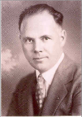
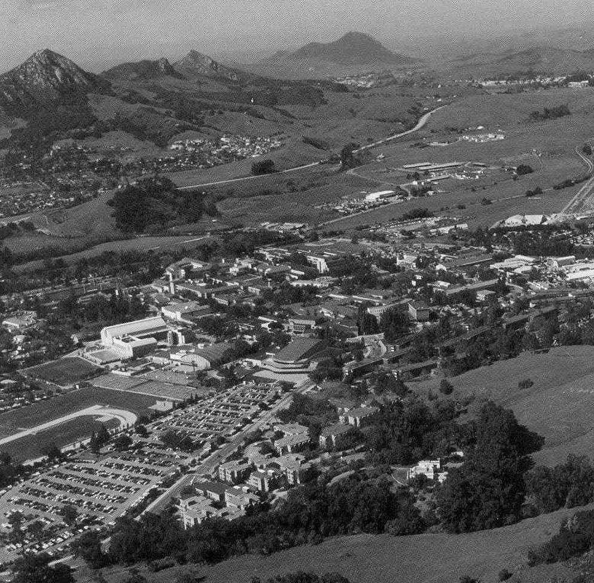

Introduction
============

Brief History of San Luis Obispo
--------------------------------

Before discussing the history of the Computer Science Department, we
need some background on the city and university in which the department
started. So lets look at some history of the central coast of California
and how San Luis Obispo and Cal Poly got started.[^1]

San Luis Obispo, Ca., a city of 44,000, lies half way between Los
Angeles and San Francisco along Highway 101, about 8 miles from the
Pacific Ocean at an elevation of 300 feet. Early residents of the
Central Coast were Chumash Indians.

One of the first central coast explorers was Juan Rodriguez Cabrillo who
sailed into northern Santa Barbara Channel in mid-October 1542. He was
favorably impressed with the Native Americans, the Chumash, who followed
a hunting and gathering lifestyle, both marine and inland between Malibu
in the south and Cayucos in the north. He observed that these Indians of
the Central coast wore animal skins and tied their hair with tiny
daggers of bone, flint and wood embedded in the braids, and were capable
of sailing great distances in their tar-caulked canoes.

In 1765, King Charles III appointed Jose de Galvez as “Visitador
General” of New Spain (California Territory). Galvez assumed that Russia
in their expansion east through Siberia might pose a threat to take over
the California territory, so he organized Father Junipero Serra, Father
Juan Crespi and their band of energetic priests, together with the
soldier-explorer, Gaspar de Portola and his 63 soldiers to explore and
colonize alta California. They left San Diego on July 14, 1769, blazing
a trail which for the most part became El Camino Real, California’s
trail of 21 missions between San Diego and San Francisco. This party of
men consisted of 200 horses and pack animals, and was about a half mile
long, traveling single file on a narrow trail.

California Mission System
-------------------------

The missions served a dual purpose. First, from the standpoint of Spain,
the missions were a low-cost way of colonizing frontier lands. With just
a handful of soldiers and missionaries, the Native Americans could be
converted to Christianity and made loyal citizens of Spain. A Franciscan
mission was intended to become within one or two decades a
self-sufficient Hispanic village. The Franciscans could then be assigned
to fresh frontier lands. Second the church would then benefit by later
converting the mission to a parish, staffed by regular parish priests,
under the supervision of a bishop.

Father, Junipero Serra, established the San Luis Obispo Mission on
September 1, 1772 and set Joseph Caveller in charge with 5 soldiers and
two missionized Indians and left for San Diego. During Caveller’s 17
years of administration, there had been regular agricultural surpluses
above what the mission needed to sustain itself, a tribute to the
fertile lands in the central coastal valleys. The mission was
sufficiently prosperous to make an indirect contribution toward the cost
of Spain in fighting England during the American Colonies’ war of
independence. In 1782 the assessment for each of the California Missions
was approximately $1000.00. To this extent, San Luis Obispo played a
tiny part in the success of the 13 Colonies in winning their
independence.

From 1521 until 1822, the mission enterprises thrived under Spain’s
policy of protectionism and benevolent neglect. Mexico took over
California in 1822, but Mexico’s political, economic and social
instability all were real problems. Sustaining the government in Alta
California had a high cost for Mexico.

From Mexico to California
-------------------------

The Mexican war (1846-1848), was fought between the United States and
Mexico. The following disagreements led up to the war. When Texas
revolted against the Mexican Government in 1836, Mexico refused to
recognize its independence. Mexico warned the United States that if
Texas were admitted into the union, Mexico would declare war. In 1845
Texas was made a state, Mexico broke off relations with the U. S. but
did not declare war. There was a dispute over the boundary between
Mexico and Texas. Mexico owed the U.S. $3 million for lives and property
lost in the Mexican revolution. Also the feeling persisted in the U.S.
that the country needed to expand westward. Shortly after James Polk
became President, he sent John Slidell to Mexico to purchase the
territories of California and new Mexico for forty million dollars. The
Mexican government refused the offer, so Polk tried to start a war by
stationing American troops in disputed territory. As hoped, the Mexicans
attacked and the United States Congress declared war on Mexico on May
13, 1846.

In the course of the war, United States forces invaded Mexico and
occupied the Capital, Mexico City. By the treaty of Guadalupe Hidalgo,
the U.S. acquired from Mexico, the regions of California, Nevada, Utah
and parts of Arizona, New Mexico, Colorado and Wyoming. Thus San Luis
Obispo became a part of the United States.

Current City of San Luis Obispo
-------------------------------

The City of San Luis Obispo serves as the commercial, governmental and
cultural hub of California’s Central Coast. One of California’s oldest
communities, it began with the founding of Mission San Luis Obispo de
Tolosa in 1772 by Father Jun' ipero Serra, the fifth mission in the
California chain of 21 missions. The mission was named after Saint
Louis, a 13th Century Bishop of Toulouse, France. San Luis Obispo is
Spanish for literally the phrase, \`"Saint Louis, the Bishop.\`" First
incorporated in 1856 as a General Law City, it became a Charter City in
1876.

California Polytechnic State University
---------------------------------------

Cal Poly’s 400 acre central core campus lies at the northeast edge of
San Luis Obispo, providing sweeping views of nearby peaks and valleys.
To the north, an additional 5,651 acres of campus are devoted to
farming, experimental architecture, and other outdoor laboratory study,
making Cal Poly’s one of the largest campuses in the nation. Students
live both on-campus and off.

In 1901 San Luis Obispo was a farm and rail community of just over 3,000
people. The long awaited arrival of the railroad from the north in 1894,
followed in 1901 by connecting rail link to Los Angeles, opened the
central coast of California to the major cities and economic centers in
the state. And it was on March 8, 1901, that legislation founding
California Polytechnic School was signed into law after six years of
debate.

Early Photograph of Cal Poly.

Cal Poly emphasized learning by doing and earning while learning and
established once and for all Poly’s applied laboratory approach to
education. In 1972, California Polytechnic College was renamed
California Polytechnic State University and currently (2002) has 18,000
students with research, teaching and a graduate MS program in most
disciplines.

Cal Poly carries out its “learn by doing” via hands-on learning through
a project and design-centered curriculum. In the College of Engineering
there are more than 80 laboratories occupying 160,000 square feet.[^2]

Julian A. McPhee, President of Cal Poly, 1933-1966, strongly advocated
“hands-on” learning through project and design centered courses.

Robert Edwin Kennedy, President of Cal Poly, 1967-1979, said, “We
believe it is not a question of either occupational or broad cultural
training. Education must include both. And it should be remembered that
the difference in emphasis and the ways and means used by different
colleges give American education much of its strength.”

Warren J. Baker, President of Cal Poly, 1979-2011, “Cal Poly is in a
state of transition–a transition that will certainly preserve the
character of Cal Poly, but will change the way in which that character
is manifested. Not only is this change desirable, it is necessary if we
are going to maintain the momentum Cal Poly has gathered and take the
next steps to become a truly great university...”

Jeffrey Armstrong, President of Cal Poly since 2011.

Cal Poly Campus and background mountains.

[^1]: San Luis Obispo county, Winsor Publications, Inc. second
    Edition,1990.

